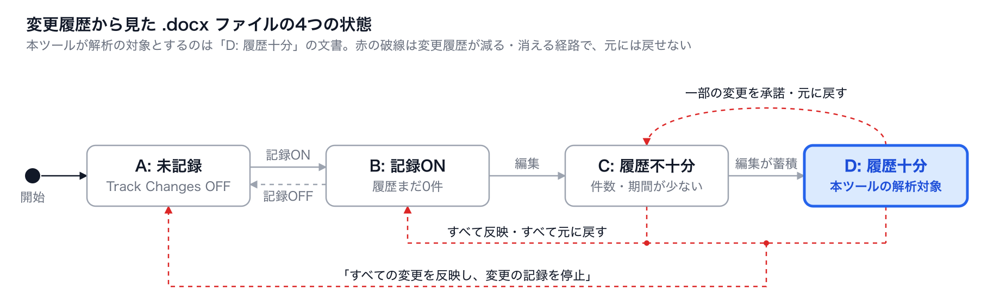
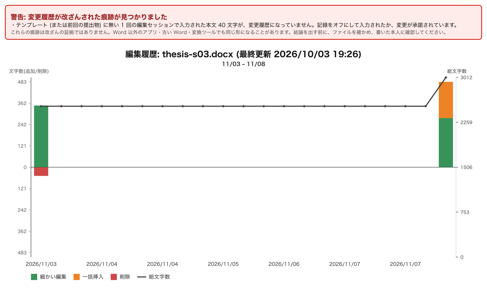
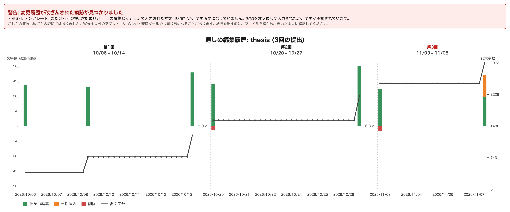

# docx-revision-analyzer

[](./LICENSE)
[English](./README.md) | 日本語

Word の変更履歴 (Track Changes / 校閲) が記録された `.docx` から、その文書が**どう書かれたか**を図にするツール群です。
いつ・どこを・どれだけ書き足し、消し、まとめて貼り付けたかを、時系列のチャートと、ページの模式図をつないだ編集フローで示します。


| コマンド | すること |
|---|---|
| `docx-revision-chart` | 追加・削除した文字数と総文字数の推移を SVG のチャートにする |
| `docx-revision-flow` | 連続して編集した時間区間ごとに、開始時点と終了時点のページの模式図を並べ、段落・図表ごとの変化を帯で描く |
| `docx-ai-suspicion-score` | 外部で作った文章の貼り付けを疑わせる、不自然な文字数の増え方を 0〜100 のスコアにする |
| `docx-revision-snapshot` | 卒論のように長く書く文書を、区切りごとの提出として通し番号付きで保管し、すべての回を通したチャートにする |

あわせて、提出物に残る**改ざんの痕跡**を調べて図に警告を出し、配布するテンプレートに**変更履歴のロック**をかけることもできます。
npm パッケージ、Node.js の要らない単体実行ファイル、ドラッグ&ドロップ版、デスクトップアプリ (プレビュー) があります。
解析はすべて手元のコンピュータで行い、文書をどこにも送りません。

> **このツールの位置づけ**: 書き手が自分の文書の執筆過程を振り返るための道具であり、他人を取り締まるためのものではありません。
> 変更履歴は欠けさせたり作り替えたりでき、どの出力も文書がどう書かれたかの証拠にはなりません ([制限と注意](#制限と注意))。

---

## ユースケースの例

### 1. 自分の執筆を振り返る

書き始める前に変更履歴の記録をオンにしておけば、書き終えた後で、どの日にどこをどれだけ書き、どこを大きく直したかを見返せます。

```bash
docx-revision-flow 報告書.docx -p 2     # 2時間以上空いたところで区切って、編集フローを描く
```

### 2. レポート課題の提出物を確かめる (Microsoft Teams)

教員が変更履歴をロックしたテンプレートを作り、Teams の課題で学生ごとのコピーを配ります。集まった提出物はフォルダごと解析し、
記録をオフにした・ロックを外した・別の文書に差し替えた、といった痕跡のある提出物は、図に警告が付き、ファイル名で区別されます。

```bash
docx-revision-chart --lock template.docx                    # テンプレートに変更履歴のロックをかける
docx-revision-chart 提出物/ --template template.docx         # 提出物を、配ったテンプレートと照合して図にする
```

### 3. 卒論を区切りごとに指導する

何か月も書き続ける文書は、区切り (スプリント) ごとに提出させて保管し、変更を承諾して返します。古い版が消えても、
自分の書き直しが変更履歴に残らなくても、区切りをまたぐ推敲はすべて残り、すべての回を通して見返せます。

```bash
docx-revision-snapshot 保管先/ 提出物-第3回/                 # 第3回の提出を保管し、通しのチャートを作り直す
```

Word・OneDrive・Teams での具体的な手順は[運用ガイド](docs/operations-guide.ja.md)にあります。

---

## 前提とする `.docx` ファイル

**本ツールは、下図の「D: 履歴十分」とみなされる `.docx` ファイルを対象として、その内容の解析処理を行うものです。**
各ツールは `.docx` の中に保存された変更履歴 (`w:ins` / `w:del` と、その `w:date` / `w:author`) を読み取るため、
ファイルから何がわかるかは、その履歴がどれだけ残っているかで決まります。文書は状態Aから始まり、常に次の4つの状態の
どれかにあります。



| 状態 | 文書の状態 | ツールの動作 |
|---|---|---|
| **A: 未記録** | 変更履歴の記録がオフで、編集が記録されない | 変更履歴の記録がオフで保存されたファイルである旨のエラーで終了 |
| **B: 記録ON** | 記録はオンだが、その後まだ編集されていない | 変更履歴がまだない旨のエラーで終了 |
| **C: 履歴不十分** | 編集は記録されているが、件数が少ない・期間が短い | 実行はできるが、チャートやフローに表れる情報が乏しく、`docx-ai-suspicion-score` は挿入イベントが5件未満だと統計的に弱い旨の警告を出す |
| **D: 履歴十分** | 十分な件数の編集が十分な期間にわたって記録されている | **本ツールの解析対象**。意味のある結果が得られる |

文書は、変更履歴の記録をオンにしたまま書き進めることで A → B → C → D と進みます。記録は執筆を**始める前に**
オンにしてください (校閲タブ → 変更履歴の記録)。オフの間に入力した内容は記録されません。

逆向きに戻る経路もあり、図の赤い破線はどれも変更履歴が失われる操作です。

- **D → C:** 変更を個別に承諾する・元に戻すと、その変更は履歴から消え、解析に足りる量を下回ることがあります。
- **C / D → B:** 「すべての変更を反映」または「すべての変更を元に戻す」を実行すると、変更履歴がすべて消えます。
  記録はオンのままなので、「記録ONで履歴まだ0件」の状態に戻ります。
- **C / D → A:** 「すべての変更を反映し、変更の記録を停止」を実行すると、変更履歴がすべて消え、記録もオフになります。

変更履歴の記録をオフにする操作はこれらに含まれません。状態CやDでオフにしても、記録済みの変更履歴はファイルに残り、
それ以降の編集が記録されなくなるだけです。状態Bでオフにすると状態Aに戻りますが、失われる履歴はありません。

**失われた変更履歴は取り戻せません** (OneDrive に保存したファイルは、[運用ガイド](docs/operations-guide.ja.md#onedrive-に保存したファイルの場合)を参照)。
履歴を残したいときは、変更を承諾する・元に戻す前に解析するか、ファイルのコピーを取っておいてください。

各変更に日時が残っているかも確認してください。文書が「ファイルを保存するときにファイルのプロパティから個人情報を
削除する」設定になっていると、保存のたびに Word がすべての変更履歴から作成者と日時を取り除くため、状態Dであっても
時系列が失われます。「[日時が記録されない場合](docs/usage.ja.md#日時が記録されない場合---preserve-history)」を参照してください。

---

## 出力の例

### 編集履歴のチャート (`docx-revision-chart`)


2日にわたる3回の執筆を、2時間以上空いたところで区切って並べたものです (`-p 2`)。上向きの棒が追加した文字数
(緑は細かい編集、オレンジはまとめて貼り付けた一括挿入)、下向きの赤い棒が削除した文字数、折れ線が総文字数です。
2回目の最初に、まとめて貼り付けた文章がオレンジで表れています。→ [図の見方](docs/usage.ja.md#出力される図の見方)

### 編集フロー (`docx-revision-flow`)

冒頭の図です。各列がその時点の文書のページの模式図で、列の間の帯が段落・図表ごとの変化 (緑は細かい編集、オレンジは
一括挿入・置き換え、赤は削除、青は移動・並べ替え) を表します。→ [図の見方](docs/usage.ja.md#図の見方)

### 改ざんの痕跡の警告



記録をオフにして入力した段落がある提出物の例です。痕跡が見つかった図には上部に警告が付き、ファイル名の末尾が
`-tampered` になる (`<名前>-tampered.svg`) ため、大人数の提出物でも一覧で見分けられます。
→ [改ざんの痕跡の検出](docs/usage.ja.md#改ざんの痕跡の検出)

### 区切りごとの提出を通した編集履歴 (`docx-revision-snapshot`)



卒論を3回に分けて提出した例です。1回の提出が1つのパネルになり、回の間の空白期間 (5.9 d など) を示します。
前の回にもあった変更は重ねて数えません。→ [`docx-revision-snapshot`](docs/usage.ja.md#4-docx-revision-snapshot--区切りごとの提出の保管と通し解析)

### AI不正利用疑いスコア (`docx-ai-suspicion-score`)

```json
{
  "file": "suspicious-paste.docx",
  "score": 93,
  "riskLevel": "very_high",
  "topSuspiciousEvents": [
    { "date": "2026-05-11T14:02:37.911Z", "chars": 295, "dtSeconds": 1, "impliedCps": 295, "eventScore": 100 }
  ]
}
```

少しずつ入力した後に 295 文字を1秒で挿入した文書の例です。→ [スコアの算出方法](docs/usage.ja.md#スコアの算出方法-アルゴリズムの説明)

---

## 利点

- **完成した文章ではなく、書いた過程が見える。** いつ・どこを・どれだけ書き、消し、まとめて貼り付けたかを、文書の位置と結びつけて示します。
- **Word と Teams の標準機能だけで運用できる。** 書き手に特別なアプリを入れてもらう必要はなく、変更履歴の記録をオンにして書いてもらうだけです。
- **大人数の提出物をまとめて処理できる。** フォルダを渡すと、すべての `.docx` の図と一覧 (`summary.csv`・`index.html`) を作ります。
  痕跡のある提出物はファイル名で見分けられます。
- **長期の執筆にも使える。** 区切りごとの提出を通し番号付きで保管し、すべての回を通して見返せます。
- **文書を外に出さない。** 解析はすべて手元で行います。デスクトップアプリは、OneDrive / SharePoint から文書を読み込むとき以外の外部への通信を遮断します。
- **英語と日本語に対応し、ライブラリとしても使える。** 解析と描画のコアはブラウザでも動きます。

## 制限と注意

- **変更履歴の記録が前提です。** 記録がオフの間の編集は残らず、解析できるのは上図の状態Dの文書です。
- **どの出力も証拠になりません。** 変更履歴は、記録をオフにする・承諾する・XML を書き換えることで欠けさせたり作り替えたり
  できます。改ざんの痕跡の検出も、痕跡が無いことの保証にはならず、Word 以外のアプリで保存しただけで痕跡が出ることもあります。
- **スコアとハイライトはヒューリスティックです。** タイピングの速い人や、別のアプリで下書きして貼り付けた本人の文章も高く
  出ることがあり (誤検知)、AI の文章を少しずつ書き写せばすり抜けます (見逃し)。判断は必ず人が文脈と合わせて行ってください。
- **記録されない編集があります。** 自分で挿入した文字を自分で消すと記録が残らず、Word の日時は分単位のことが多くあります。
- **対象は本文だけです。** 脚注・ヘッダー・テキストボックスの中は対象外で、フローのページは模式図 (近似) です。
- **確かめきれていない環境があります。** Word for the web で保存したファイルでの痕跡の検出は、まだ十分に確かめていません。
  変更履歴のロックは、ファイルを書き換えれば外せる弱い保護です。

---

## ドキュメント

| ドキュメント | 内容 |
|---|---|
| [インストール](docs/installation.ja.md) | npm・単体実行ファイル・ドラッグ&ドロップ版・デスクトップアプリの入手と準備 |
| [使い方](docs/usage.ja.md) | 4つのコマンドのオプションと図の見方、改ざんの痕跡、日時が記録されない場合、設定ファイル、表示言語、デスクトップアプリ |
| [運用ガイド](docs/operations-guide.ja.md) | Word・OneDrive・Teams と組み合わせた運用 (テンプレートのロック、課題での配布、学生への指示、区切りごとの提出、提出物の確認) |
| [高度な使い方](docs/advanced.ja.md) | 解析結果の JSON、図への注釈、ハイライトの判定ルール、整合性についての情報 |
| [ライブラリとして使う](docs/library.ja.md) | Node.js・ブラウザからの利用、分類器、色のカテゴリ、各編集の位置 |
| [開発者向けガイド](docs/development.ja.md) | ソースからのビルド、単体実行ファイルとドラッグ&ドロップ版の作り方、公開、フィクスチャ、ディレクトリ構成 |

## コントリビュート・ライセンス

Issue / Pull Request 歓迎です ([GitHub Issues](https://github.com/kubohiroya/docx-revision-analyzer/issues))。
ライセンスは [MIT](./LICENSE) © 2026 Hiroya Kubo です。
