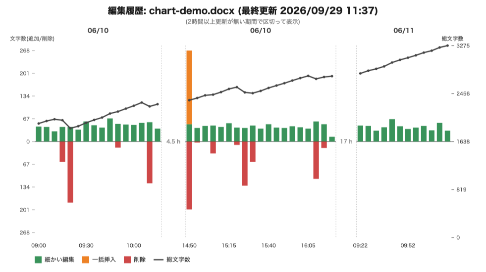
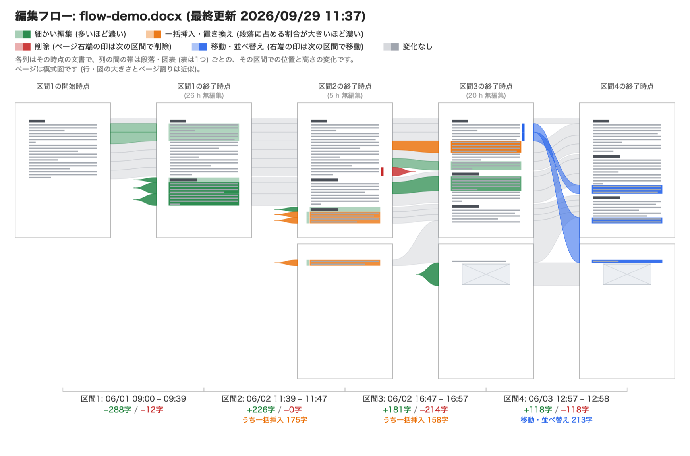

# docx-revision-analyzer

[](./LICENSE)
[English](./README.md) | 日本語

変更履歴 (Track Changes / 校閲) を有効にして編集された Word ファイル (`.docx`) から、

1. **`docx-revision-chart`** — 編集の時系列を可視化する SVG チャートを生成
2. **`docx-revision-flow`** — 連続的に編集が行われた時間区間ごとに、開始時点と終了時点の
   文書のページの模式図を並べ、細かい編集 (緑)・一括挿入や置き換え (オレンジ)・削除 (赤) と、
   段落・図表ごとの変化を示す帯を描いた SVG を生成
3. **`docx-ai-suspicion-score`** — 「外部で作文した文章を貼り付けたのでは」と疑われる
   不自然な文字数増加を検出し、0〜100の「AI不正利用疑いスコア」を算出

する3つの CLI ツールです。npm パッケージとして公開しているほか、[Bun](https://bun.sh) で
依存パッケージ込みの単一実行ファイル (シングルバイナリ) にしたものも配布しています (Node.js 不要)。
ライセンスは MIT です。

> **重要な前提**: どのツールも、Word の「変更履歴の記録」(校閲タブ → 変更履歴の記録) を
> 有効にした状態で作成・編集された `.docx` ファイルが必要です。変更履歴の記録がオフの状態で
> 編集されたファイルには挿入(`w:ins`)/削除(`w:del`)の情報が残らないため、解析できません
> (その場合は理由を示してエラーになります)。

---

## インストール

### npm から (Node.js 18 以降)

```bash
npm install -g docx-revision-analyzer
```

`docx-revision-chart` / `docx-revision-flow` / `docx-ai-suspicion-score` の3つのコマンドが使えるようになります。

### 単体バイナリ (Node.js 不要)

[GitHub Releases](https://github.com/kubohiroya/docx-revision-analyzer/releases) から、お使いの OS / CPU に合ったファイルをダウンロードして展開してください。

| ファイル | 内容 |
|---|---|
| `docx-revision-<chart\|flow>-<OS>-<CPU>.zip`、`docx-ai-suspicion-score-<OS>-<CPU>.zip` | 各ツールの単体実行ファイル (`linux-x64` / `linux-arm64` / `macos-x64` / `macos-arm64` / `windows-x64`) |
| `docx-revision-<chart\|flow>-macos-arm64.app.zip` | macOS (Apple Silicon) 用のドラッグ&ドロップ版アプリ。Finder で `.docx` をアイコンにドロップすると、同じフォルダに SVG を出力します |

ドラッグ&ドロップ版は署名が ad-hoc のため、初回は Finder でアプリを右クリックして「開く」を選んでください。
Windows では `.exe` に `.docx` を直接ドロップできます。

ソースからのビルド、単体バイナリやドラッグ&ドロップ版の作り方、テスト用フィクスチャ、ディレクトリ構成は
[INSTALL.ja.md](./INSTALL.ja.md) を参照してください。

---

## 1. `docx-revision-chart` — 編集履歴のSVGチャート化

```bash
node dist/cli/chart.js <input.docx> [input2.docx ...] [options]
```

複数の入力ファイルをまとめて指定できます (各ファイルは独立に処理され、
1件が失敗しても残りの処理は続行されます)。主にWindowsで、エクスプローラーから
複数ファイルを実行ファイルにドロップした際に、それらが1回の起動に対する
複数の引数として渡されるケースに対応するためのものです。`-o/--output` は
入力ファイルが1つの場合のみ使用できます。

| オプション | 説明 | 既定値 |
|---|---|---|
| `-o, --output <file.svg>` | 出力SVGのパス (単一ファイル指定時のみ使用可) | `<入力ファイル名>.svg` |
| `-b, --bucket <spec>` | 時間バケットの粒度: `auto`\|`second`\|`minute`\|`hour`\|`day`、または秒数 | `auto` |
| `-p, --gap-threshold <hours>` | 「連続的に更新が行われた期間」と「更新が無かった期間」を区別する閾値(時間)。指定すると期間ごとに分割した詳細なグラフを水平に並べて表示する (下記参照) | 指定なし (全体を1枚のグラフにする) |
| `-w, --width <px>` | 画像の幅 | `1100` (`-p` 指定時は内容に応じて自動計算) |
| `-H, --height <px>` | 画像の高さ | `550` |
| `-t, --title <text>` | チャートタイトル | `編集履歴: <ファイル名> (最終更新 <ファイルの最終更新日時>)` |
| `--bulk-chars <n>` | 同じ作成者・同じ時刻にまとめて挿入された文字数がこれ以上なら一括挿入とみなす (`docx-revision-flow` と同じ規則) | `150` |
| `--json [file.json]` | 解析結果 (挿入の窓と特徴量) を JSON にも出力する。下の「解析結果の JSON」を参照 | 出力しない (名前を省略すると `<出力名>.json`) |
| `--window-seconds <s>` / `--window-chars <n>` / `--window-paras <n>` | 挿入の窓: 時間窓 Δt と、文書上の距離 (文字数 / 段落数) | `60` / `2000` / 指定なし |
| `--preserve-history` | 文書が「保存時に個人情報 (変更履歴の作成者・日時) を削除する」設定の場合に、その設定を外し「変更履歴の記録」もオンにして上書き保存する (元のファイルはバックアップとして残す。文書が開かれている場合はエラー)。`--preserveHistory` でも可。下記「日時が記録されない場合」参照 | off |
| `--check-history-settings` | チャートは作らず設定の確認だけを行い、1行目に `ok` / `needs-fix`、`needs-fix` なら2行目以降に確認用の文面を出力する | off |
| `--drop` | デスクトップからのドラッグ&ドロップ起動モード。`-o` 未指定時、各ファイルの出力先を通常の `<ファイル名>.svg` ではなく `<入力と同じディレクトリ>/<そのファイル名>-<そのファイルの最終更新日時>.svg` にする。macOS用Finderドロップレット ([INSTALL.ja.md](./INSTALL.ja.md) 参照) や、Windowsエクスプローラーからの直接ドロップ(またはターミナルを介さない他の起動方法)向け。Windows上ではさらにネイティブなメッセージボックスで結果を表示する | off |
| `--lang <en\|ja>` | メッセージと図の表示言語 (下記「表示言語」参照) | OS のロケール |

### 出力される図の見方



上の図は `fixtures/chart-demo.docx` (2日にわたる3回の執筆。細かく入力しながら下書きを大小さまざまな単位で
散発的に削除し、2回目の最初 (14:50) に文章をまとめて貼り付け) に対する、次のコマンドの出力です。
`-p 2` により、2時間以上の無編集期間で区切った期間ごとに並べ、期間の間に無編集期間の長さ (4.5 h・17 h) を示しています。

```bash
node dist/cli/chart.js fixtures/chart-demo.docx -p 2
```


- **横軸**: 時間 (バケットごとに集計)
- **上向きの棒**: そのバケット内で追加された文字数を、下から次の順に積み上げたもの
  (判定の規則は `docx-revision-flow` と同じ)
  - **緑 (細かい編集)**: 一括挿入・移動/並べ替え以外の挿入
  - **オレンジ (一括挿入)**: 同じ作成者・同じ時刻の挿入の合計が `--bulk-chars` 文字以上のもの。
    Word は貼り付けた文章を段落ごとに別々の挿入として記録しますが、時刻は同じになるためです
  - **青 (移動・並べ替え)**: 削除された文章と同じ内容 (20文字以上) の挿入。コピー＋貼り付け＋削除などによる
    文書内の並べ替えで、該当する挿入がある場合だけ表示・凡例に載ります
- **下向きの棒 (赤)**: そのバケット内で削除された文字数 (絶対値で表示)
- **折れ線 (濃い灰色、右軸)**: バケット終了時点での文書の総文字数 (追跡開始前の
  文字数 + それまでの純増減の累計)

Word が移動として記録した変更 (`w:moveFrom` / `w:moveTo`) は、文字数が増減しないため棒には含めません。

```bash
node dist/cli/chart.js fixtures/natural-writing.docx -o out.svg
```

同梱の `fixtures/*.svg` (および見た目確認用の `fixtures/*.png`) がサンプル出力です。

### `-p` オプション: 更新期間ごとの詳細表示

`-p <時間>` を指定すると、直前の変更履歴イベントからの経過時間がこの閾値を
超えるたびに「無編集期間」とみなして区切り、**連続的に更新が行われた期間 (セッション)
ごとに独立したグラフを作成して水平に並べます**。各セッションは独立に時間バケットへ
集計されるため、たとえば数日にわたる編集履歴でも、1本の全体グラフでは埋もれてしまう
短時間の編集の起伏を、セッションごとに詳細に見ることができます。

セッションとセッションの間には、ラベル文字 (`"12 h"` のように、およそ4文字分) が
収まる程度の狭い間隔を破線区切りで挿入し、その間の無編集期間の長さを表示します。
追加/削除文字数の縦軸、総文字数の縦軸 (右軸) はすべてのセッションで共通のスケールを
使うため、セッション間で活動量を比較できます。総文字数の折れ線は、無編集期間をまたいで
実際には経過していない時間を線でつながないよう、セッションごとに独立させています。

```bash
node dist/cli/chart.js fixtures/multi-session.docx -p 12 -o out.svg
```

同梱の `fixtures/multi-session.docx` (3日間、間に29時間・20.5時間の空白を挟んだ想定)
に対する `-p 12` の出力例が `fixtures/multi-session-p12.svg` / `.png` です。
`-p` を指定しない場合の全体表示 (`fixtures/multi-session-single.svg` / `.png`) と
見比べると、セッションに分割することで編集の起伏がどれだけ詳細に見えるようになるかが
わかります。

---

## 2. `docx-revision-flow` — 時間区間ごとの編集フロー

変更履歴を「連続的に編集が行われた時間区間」に分け、最初の区間の開始時点と各区間の終了時点の文書を
ページのサムネイル (模式図) の列として左から右へ時系列順に並べ、列の間に、その区間での段落・図表ごとの変化を
帯で描いた SVG を1枚出力します。区間と区間の間には変更が無いため、前の区間の終了時点の列が次の区間の
開始時点を兼ねます。

```bash
node dist/cli/flow.js fixtures/flow-demo.docx -o flow.svg

# 期間を指定し、2時間以上の無編集期間で区間を分ける
node dist/cli/flow.js 報告書.docx --from 2026-06-01 --to "2026-06-02 18:00" -p 2
```



| オプション | 説明 | 既定値 |
|---|---|---|
| `-o, --output <file.svg>` | 出力するSVGファイルのパス | `<入力ファイル名>-flow.svg` |
| `-p, --gap-threshold <hours>` | 無編集期間がこの時間を超えたら、別の時間区間に分ける | `1` |
| `--from <datetime>` / `--to <datetime>` | 対象期間 (ローカル時刻。`2026-06-01` や `"2026-06-01 09:30"` の形式。日付だけの `--to` はその日の終わりまで) | 全期間 |
| `--bulk-chars <n>` | 同じ時刻にまとめて挿入された文字数がこれ以上なら一括挿入とみなす | `150` |
| `--json [file.json]` | 解析結果 (挿入の窓と特徴量) を JSON にも出力する。下の「解析結果の JSON」を参照 | 出力しない (名前を省略すると `<出力名>.json`) |
| `--window-seconds <s>` / `--window-chars <n>` / `--window-paras <n>` | 挿入の窓: 時間窓 Δt と、文書上の距離 (文字数 / 段落数) | `60` / `2000` / 指定なし |
| `--page-width <px>` | ページのサムネイルの幅 | `150` |
| `--slope-width <px>` | サムネイルの列の間 (変化を示す帯) の幅 | `72` |
| `-t, --title <text>` | 図のタイトル | `編集フロー: <ファイル名> (最終更新 <ファイルの最終更新日時>)` |
| `--drop` / `--preserve-history` / `--check-history-settings` | `docx-revision-chart` と同じ。`--drop` の出力先は `<ファイル名>-flow-<最終更新日時>.svg` | |
| `--lang <en\|ja>` | メッセージと図の表示言語 (下記「表示言語」参照) | OS のロケール |

時系列解析できる変更履歴が無い場合や、指定した期間に変更履歴が無い場合は、SVG を作らずにエラーになります。

### 図の見方

- **各列**: 先頭の列は区間1の開始時点 (最初の変更の直前)、以降は各区間の終了時点の文書です。その時刻以前の変更は
  反映し、それより後の変更は元に戻した状態を、ページごとに縦に並べています。灰色の横線が本文の行、濃い横線が見出し、
  青みがかった横線が表、×印の四角が図です。列の見出しには、その後の無編集期間の長さも示します。
- **列の間の帯**: その区間について、段落・図表 (表は全体で1つ) ごとに、開始時点と終了時点の位置と高さを結んでいます。
  帯が太くなれば内容が増え、細くなれば減っています。行き先の無い赤い帯は区間内に削除された段落・図表、
  中央から右へ広がる帯は追加された段落・図表 (一括挿入ならオレンジ、それ以外は緑)、灰色は変化の無いものです。
- **青 (移動・並べ替え)**: 移動元の位置から移動先の位置へ青い帯で結びます。順序が入れ替わった箇所では、
  他の段落の帯と交差します。移動先の段落は青く塗ります。
- **ページ右端の印**: 次の区間で削除される (赤)・移動していく (青) 段落・図表です。
- **緑 (細かい編集)**: その区間に小さな挿入・削除が繰り返された段落です。
  濃さは「細かい編集の文字数 ÷ 段落の文字数」と「細かい編集の回数 ÷ 8」の大きい方 (上限1) です。
- **オレンジ (一括挿入・置き換え)**: その区間にまとめて挿入された文章が占める段落です。
  濃さは「一括挿入された文字数 ÷ 段落の文字数」です。
- 緑とオレンジは、その区間の終了時点の列に塗ります。両方に当てはまる段落は度合いの大きい方の色で塗り、
  もう一方の色を段落の左側の細い帯で示します。
- **帯の下**: 区間の開始・終了の月日時分、のべ追加・削除文字数、そのうち一括挿入された文字数です。

### 一括挿入の判定

Word は複数の段落を貼り付けると段落ごとに別々の挿入 (`w:ins`) として記録しますが、日時は同じになります。
そこで、同じ作成者・同じ日時の挿入の合計が `--bulk-chars` 文字以上なら、それらをすべて一括挿入とみなします。
また、一括挿入と同じ作成者・同じ日時の削除は置き換え前の文章の削除とみなし、細かい編集には数えません。

### 移動・並べ替えの判定

段落の並べ替えは、操作によって変更履歴への記録のされ方が異なります。

- **カット＋貼り付け・ドラッグ＆ドロップ**: 「移動を記録する」がオン (既定) なら、Word は移動
  (`w:moveFrom` / `w:moveTo`) として記録します。移動元と移動先は、Word が付ける範囲名で対応づけます。
- **コピー＋貼り付け＋削除**、および移動として記録されなかったカット＋貼り付け: 挿入と削除として記録されます。
  そこで、挿入された文章 (20文字以上) と同じ内容が文書のどこかで削除されていれば、文書内での並べ替え・複製と
  みなします。同じ区間内に対応する削除があれば、移動元と移動先として青い帯で結びます。

どちらの場合も、並べ替えた文章は一括挿入 (オレンジ) にも細かい編集 (緑) にも数えません。
キャプションには「移動・並べ替え N字」として示します (のべ追加・削除文字数には、挿入と削除として
記録された並べ替えも含まれます)。

### 限界

- ページは模式図で、Word の実際のレイアウトではありません。1行の文字数は用紙幅と文字サイズから、
  1ページの行数は行送りから見積もり、Word が最後に保存したときのページ数 (`docProps/app.xml`) に
  最終状態のページ数が合うよう補正しています。過去の区間のページ割りは、この補正を流用した近似です。
- Word は、自分で挿入した文字を自分で削除すると記録を残しません。区間内で書いては消した分は数えられません。
- Word の日時は分単位で記録されることが多いため、1分間に `--bulk-chars` 文字以上を手で入力した場合も
  一括挿入と判定され得ます。
- 書式だけの変更は色付けの対象外です。挿入と削除として記録された並べ替えは、内容が完全に一致する場合
  (空白の違いは無視) だけを判定します。貼り付けた後に手を加えた部分は、並べ替えではなく編集として扱われます。文字を含まない図の追加は、
  帯では「追加」(緑) として示しますが、段落の塗りはしません。
  本文 (`word/document.xml`) だけが対象で、脚注・ヘッダー・テキストボックス内は対象外です。
- 一括挿入の判定はヒューリスティックであり、不正の証拠にはなりません (`docx-ai-suspicion-score` と同様)。

---

## 3. `docx-ai-suspicion-score` — AI不正利用疑いスコア

```bash
node dist/cli/score.js <input.docx> [options]
```

| オプション | 説明 | 既定値 |
|---|---|---|
| `-o, --output <file.json>` | 結果の出力先 (省略時は標準出力) | - |
| `--min-chars <n>` | この文字数未満の挿入は誤検知防止のため無視 | `20` |
| `--burst-low <n>` | バーストスコアが0になる文字数境界 | `20` |
| `--burst-high <n>` | バーストスコアが100になる文字数境界 | `300` |
| `--rate-low <cps>` | 速度スコアが0になる挿入速度 (文字/秒) | `8` |
| `--rate-high <cps>` | 速度スコアが100になる挿入速度 (文字/秒) | `40` |
| `--max-weight <0-1>` | 全体スコアにおける「最も疑わしい1件」の重み (残りは文字数加重平均) | `0.6` |
| `--pretty` | JSONを整形して出力 | off |
| `--lang <en\|ja>` | メッセージと図の表示言語 (下記「表示言語」参照) | OS のロケール |

```bash
node dist/cli/score.js fixtures/suspicious-paste.docx --pretty
```

### スコアの算出方法 (アルゴリズムの説明)

Word は挿入された文字列を、挿入した日時 (秒単位) と一緒に `w:ins` 要素として
記録します。**WordのGUIで自分の手でタイプ・校閲した場合、1回の挿入イベントで
一度に増える文字数はせいぜい数十文字程度に収まる**のに対し、**外部アプリ
(ChatGPT等) で作文した完成文をコピー&ペーストした場合、1回の挿入イベントで
数百文字が一瞬 (1〜数秒) で増加**します。この違いを検出しています。

各挿入イベントについて、次の2つのスコア (0〜100) を計算し、大きい方を
そのイベントの疑いスコアとします。

- **バーストスコア**: そのイベント単体の文字数の大きさ
  (`--burst-low` 文字以下なら0、`--burst-high` 文字以上なら100、線形補間)
- **速度スコア**: 直前の挿入イベントからの経過時間に対する挿入速度 (文字/秒)
  (`--rate-low` cps以下なら0、`--rate-high` cps以上なら100、線形補間)

ただし `--min-chars` 未満の小さな挿入は常にスコア0とし、誤検知を防ぎます。

文書全体のスコアは、

```
score = max_weight × (最も疑わしいイベントのスコア)
      + (1 − max_weight) × (文字数で重み付けした全イベントの平均スコア)
```

の加重平均です (既定では `max_weight = 0.6`)。最大値だけで決めると偶然の
誤検知に引っ張られやすく、平均だけで決めると大きな1回の貼り付けが他の
多数の正常な編集で薄まってしまうため、両者をブレンドしています。

`riskLevel` は参考の目安です: `low` (0〜19) / `medium` (20〜44) /
`high` (45〜74) / `very_high` (75〜100)。

### ⚠️ 限界・注意点 (必ずお読みください)

このスコアは **統計的なヒューリスティックであり、不正の「証拠」にはなりません**。
以下のような正当なケースでもスコアが高くなり得ます (誤検知の可能性):

- 非常にタイピングが速い人、音声入力を使っている人
- 別のメモアプリやエディタで下書きしてから Word に貼り付けた人
  (本人の文章でも、貼り付けた時点では「一瞬での大量挿入」に見える)
- 表や参考文献リストなど、機械的にまとまった量を貼り付けた場合

逆に、以下のようなケースは検出をすり抜けます (見逃しの可能性):

- AIが生成した文章を、時間をかけて少しずつ手で書き写した場合
- 貼り付け後に文章全体を大きく手直しして、挿入イベントを細かく分割した場合

そのため、**このスコアは「疑いの度合いの参考情報」として使い、最終的な判断は
必ず人間 (教員等) が文脈と合わせて行ってください**。学生に不利益な判定を
自動的に下す用途には使わないことを強く推奨します。

その他の技術的な制約:

- `w:date` のタイムスタンプは秒単位精度のため、1秒未満の間隔は区別できません。
- Word の「保存時にファイルのプロパティから個人情報を削除する」設定が有効な状態で保存された文書は、
  変更履歴の日時 (`w:date`) と作成者が削除されるため解析できません (日時の無い変更履歴の件数を警告として表示します)。
- `w:moveFrom` / `w:moveTo` (文書内でのドラッグ移動等) は本バージョンでは
  特別扱いしておらず、Wordのバージョン・設定によっては通常の挿入と同様に
  カウントされる場合があります。
- 既定では `word/document.xml` (本文) のみを解析します。ヘッダー/フッター/
  コメント/脚注中の変更履歴は対象外です。

---

## 表示言語

メッセージ・ヘルプ・図は、英語または日本語で表示します。言語は次の順で決まります。

1. `--lang en` / `--lang ja`
2. 設定ファイル (下記) の `lang`
3. 環境変数 `DOCX_REVISION_LANG`
4. 環境変数 `LC_ALL` / `LC_MESSAGES` / `LANG`
5. OS の言語設定 (macOS では「システム設定 > 一般 > 言語と地域」)

日本語以外の環境では英語になります。macOS のドラッグ&ドロップ版は、macOS の言語設定に従います。

---

## 設定ファイル

既定値を変えたい場合は、ツール名の YAML ファイル (`docx-revision-chart.yml` / `docx-revision-flow.yml` /
`docx-ai-suspicion-score.yml`。拡張子は `.yaml` でも可) を実行ファイルと同じフォルダに置きます。
macOS のドラッグ&ドロップ版では `.app` と同じフォルダ、npm でインストールした場合はコマンドと同じフォルダです。

```yaml
# docx-revision-flow.yml
gap-threshold: 2
bulk-chars: 200
page-width: 120
slope-width: 60
title: "研究計画調書の編集フロー"
output: out/flow.svg
lang: ja
```

- キーは、そのツールのオプションの長い名前から `--` を除いたものです (`output`・`gap-threshold`・`bulk-chars`・
  `page-width`・`slope-width`・`title`・`bucket`・`from`・`to`・`lang` など。`docx-ai-suspicion-score` では
  `min-chars`・`burst-low`・`pretty` など)。`pretty` のようなフラグは `true` / `false` で指定します。
- コマンドラインでの指定が設定ファイルより優先され、設定ファイルは組み込みの既定値より優先されます。
- `output` の相対パスは、設定ファイルのあるフォルダを基準にします。複数のファイルをまとめて処理するときは `output` を使いません。
- 不明なキーや不正な値は警告を出して無視し、YAML として読めないファイルはエラーにします。
  どの設定ファイルを読んだかは実行時に表示します。

---

## 日時が記録されない場合 (`--preserve-history`)

「保存時にファイルのプロパティから個人情報を削除する」は Word 全体ではなく文書ごとの設定で、
`word/settings.xml` 内の `<w:removePersonalInformation/>` / `<w:removeDateAndTime/>` として保存されています。
この設定が有効な文書では、Word が保存のたびに変更履歴の作成者と日時を消してしまいます。
Windows 版 Word では [ファイル] > [オプション] > [トラスト センター] > [トラスト センターの設定] > [プライバシー オプション] でオフにできますが、
macOS 版 Word の [設定] > [セキュリティ] にはこの項目がありません。

`docx-revision-chart` と `docx-revision-flow` は、解析の前にこの設定を確認し、有効になっていれば次のように案内します
(「変更履歴の記録」がオフなだけの文書では尋ねません)。

- **CLI:** ターミナルから実行した場合は、`--preserve-history` の処理を実行するかを `[y/N]` で尋ねます
  (Enter のみ・Ctrl+D は No)。パイプ経由などで入力できない場合は、警告と案内だけを表示します。
  `--preserve-history` を付けて実行すると、尋ねずに個人情報削除の設定を外し、
  「変更履歴の記録」(`<w:trackRevisions/>`) もオンにして上書き保存します。元のファイルは `<名前>.backup-<YYYYMMDD-HHMMSS>.docx` として同じフォルダに残ります。
- **macOS のドロップレット:** 「この文書は編集者の名前と編集日時を保存するための設定が無効化されています。有効にしますか？」
  という OK/キャンセルのダイアログを表示し、OK なら `--preserve-history` を付けて実行します。キャンセルなら設定は変えずに解析だけ行います。
- **Windows の `--drop`:** 同じ内容の OK/キャンセルのメッセージボックスを表示します。

書き換えの前に、文書が Word などで開かれていないか (Word の所有者ファイル `~$…` の有無、
Windows では書き込みオープンの可否、macOS/Linux では `lsof`) を確認し、開かれている場合は書き換えずにエラーにします。
設定の確認だけを行う `--check-history-settings` もあります (ドロップレットが内部で使用)。

書き換え後の編集から日時が記録されます。すでに削除された日時は復元できません。

---

## 解析結果の JSON (`--json`)

`--json` を付けると、`docx-revision-chart` / `docx-revision-flow` は解析結果を JSON にも出力します。
中身は「挿入の窓」です。短い時間 (窓の最初の挿入から `--window-seconds` 秒以内) に、文書の近い範囲
(`--window-chars` 文字以内。`--window-paras` を指定すれば段落数も) へ行われた挿入を1つの窓にまとめます。
距離は最終文書で測り、移動・並べ替えは除きます。窓ごとの特徴量は次のとおりです。

| 特徴量 | 意味 |
|---|---|
| `insertedChars` | 挿入文字数の合計 |
| `durationSec` / `cps` | 時間幅 (秒) / 挿入速度 (文字/秒)。時間幅には推定した時刻の解像度 (`timeResolutionSec`。Word が分単位でしか記録していなければ 60、最低1秒) を足す (挿入はその幅のどこかで行われたとみなすため) |
| `spanChars` / `spanParas` | 最終文書での範囲 (文字数 / 段落数) |
| `maxSingleInsert` | 最大の単一の `w:ins` の文字数 |
| `paraCount` | 挿入が及ぶ段落の数 |
| `postEditRatio` | 窓の後にその範囲へ加えられた挿入・削除の文字数 ÷ `insertedChars` |
| `precededByDeletion` / `precedingDeletedChars` | 窓の直前または窓の間に、同じ範囲で削除があったか (置き換え) と、その文字数 |
| `insertCount` | 挿入の件数 |

特徴量そのものは判定をしません (しきい値は別に適用します)。

## ライブラリとして使う

`src/index.ts` から主要な関数・型 (`extractRevisionsFromFile`, `computeSuspicionScore`,
`renderRevisionChart` など) を再エクスポートしているため、CLIとしてだけでなく
他の Node.js / Bun プロジェクトから `import { ... } from "docx-revision-analyzer"`
としてライブラリ的に使うこともできます。

### 各編集の位置

`extractRevisionPositions` は、挿入・削除 (`w:id`) ごとに、時刻・作成者・文字数・本文と、位置 (段落インデックス・
段落内の文字オフセット・文書先頭からの文字オフセット) を持つイベント列を返します。位置は、最終文書 (すべての変更を
反映した状態) と、編集の時点 (挿入は挿入直後、削除は削除直前) の両方で求めます。オフセットは
`finalDocumentText(model)` / `documentTextAt(model, date)` (段落を `"\n"` で連結した文字列、UTF-16 単位) の中の位置です。
移動 (`w:moveFrom` / `w:moveTo`) は `move: true` として含め、`moveName` で移動元と移動先を対応づけます。
`attachRevisionPositions` で、`w:id` の対応する `RevisionEvent` に `position` を設定できます。

```ts
import { readFileSync } from "fs";
import { parseDocxLayout, extractRevisionPositions } from "docx-revision-analyzer";

const model = await parseDocxLayout(readFileSync("report.docx"));
for (const e of extractRevisionPositions(model)) {
  console.log(e.type, e.date, e.chars, e.final.start.paraIndex, e.final.start.offsetInPara);
}
```

---

## コントリビュート

Issue / Pull Request 歓迎です。バグ報告や改善提案は
[GitHub Issues](https://github.com/kubohiroya/docx-revision-analyzer/issues) へ。

---

## ライセンス

[MIT](./LICENSE) © 2026 Hiroya Kubo
