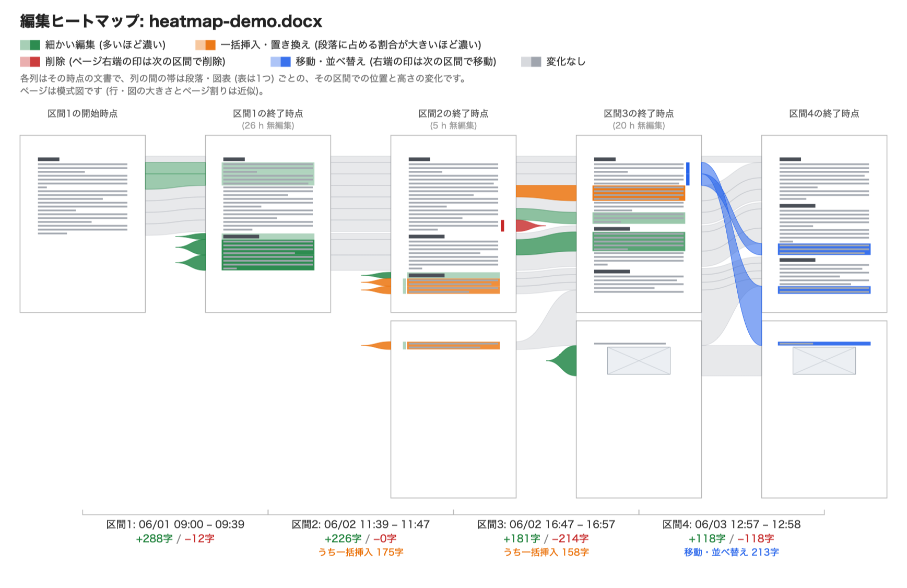

# docx-revision-analyzer

[](./LICENSE)
English | [日本語](./README.ja.md)

Three CLI tools that analyze Word (`.docx`) files edited with Track Changes
enabled:

1. **`docx-revision-chart`** — renders an SVG chart of edit activity over time
2. **`docx-ai-suspicion-score`** — scores how likely it is that a chunk of
   text was pasted in from an external app (e.g. an AI writing tool) rather
   than typed and reviewed inside Word, on a 0–100 scale
3. **`docx-revision-heatmap`** — for each session of continuous editing, draws
   the document's pages at the start and end of the session as a schematic,
   colors fine-grained edits (green), bulk insertions/replacements (orange) and
   deletions (red), and connects each paragraph/figure/table across the two

It's organized as an npm package, and `docx-revision-chart` can also be
compiled into a single, dependency-free executable with [Bun](https://bun.sh)
(no Node.js required to run it). Licensed under MIT.

> **Prerequisite**: all tools require a `.docx` file that was authored/edited
> with Word's "Track Changes" turned on (Review tab → Track Changes). Files
> edited with Track Changes off don't retain insertion (`w:ins`) / deletion
> (`w:del`) markup, so there's nothing to analyze (the tools exit with an
> error explaining why).

---

## Setup

```bash
git clone https://github.com/kubohiroya/docx-revision-analyzer.git
cd docx-revision-analyzer
npm install
npm run build
```

Requires Node.js 18+ (developed and tested on Node.js 22). After building,
run `dist/cli/chart.js` / `dist/cli/score.js` directly with `node` (see usage
below). Running `npm link` exposes them globally as `docx-revision-chart` /
`docx-ai-suspicion-score`.

---

## Building a single-binary executable with Bun (`docx-revision-chart`)

If [Bun](https://bun.sh) is installed, `docx-revision-chart` can be compiled
into a single executable that needs neither Node.js nor `node_modules` to run
(JSZip, fast-xml-parser, commander, etc. are all bundled into the binary).
Bun compiles the TypeScript source (`src/cli/chart.ts`) directly, so there's
no need to run `npm run build` first.

```bash
# Install Bun if you don't have it
curl -fsSL https://bun.sh/install | bash

# Build one binary for the current OS/CPU -> dist-bin/docx-revision-chart
npm run build:binary

# Cross-build for the major OS/CPU combinations (Linux/macOS/Windows × x64/arm64)
npm run build:binary:all
```

The resulting binary can be run and distributed as-is (no Node.js install
needed):

```bash
./dist-bin/docx-revision-chart fixtures/multi-session.docx -p 12 -o out.svg
```

This wraps `scripts/build-binary.sh` under the hood. To build a binary for
`docx-ai-suspicion-score` instead, run `npm run build:binary:score` or
`bash scripts/build-binary.sh score` (add `--all` for the same cross-build).
For `docx-revision-heatmap`, use `npm run build:binary:heatmap`
(`bash scripts/build-binary.sh heatmap`).

> Binaries cross-compiled for other OSes (`--all`) can't be smoke-tested on
> the machine that built them — verify them on the target OS before
> distributing.

---

## Finder drag-and-drop app (macOS only)

Beyond the command line, `docx-revision-chart` can be packaged as a small
macOS app (a "droplet") that you can drop one or more `.docx` files onto
directly in Finder — no Terminal needed. For each file dropped, it writes
the chart next to it, named `<filename>-<that file's last-modified time>.svg`
(e.g. `report-20260919-143000.svg`), and reports success or failure with a
native notification/dialog instead of console output.

```bash
npm run build:mac-app
```

This builds the Bun binary and wraps it into `dist-bin/docx-revision-chart.app`
using `osacompile` (an AppleScript compiler that ships with every Mac — no
extra install beyond Bun itself). Move or copy that `.app` anywhere convenient
(e.g. your Applications folder or the Dock) and drop `.docx` files onto its
icon.

`npm run build:mac-app:heatmap` builds the same kind of droplet for
`docx-revision-heatmap` (`dist-bin/docx-revision-heatmap.app`). It covers the
whole editing period with default settings and writes
`<file name>-heatmap-<that file's last-modified time>.svg`.

Why this needs a wrapper at all: macOS Finder only delivers dropped files to
proper application bundles (via an Apple Event), never directly as command-line
arguments to a bare, unbundled executable — so the raw Bun binary by itself
can't be a drop target. `scripts/make-mac-droplet.sh` generates a minimal
AppleScript application whose `on open` handler shells out to the bundled
binary with `--drop`, which is what produces the timestamped filename
described above.

A few things worth knowing:

- **macOS only**, and the build script must be run in an actual Terminal on
  your Mac — it won't run inside a sandboxed/Linux environment.
- The app is **ad-hoc code-signed** (`codesign -s -`) by the build script,
  which is enough to run it locally on Apple Silicon. It's not notarized, so
  on first launch Gatekeeper may still warn that "the developer cannot be
  verified" — right-click the app and choose **Open** once to get past that.
- Once built, the `.app` is fully self-contained; it does not need Bun,
  Node.js, or this repository to keep working.
- This has been built and reasoned through against current documentation on
  the technique, but hasn't been verified end-to-end on an actual Mac by the
  author of this feature — please open an issue if dropping a file doesn't
  behave as described.

---

## Windows drag-and-drop (no wrapper app needed)

Windows doesn't need a wrapper app the way macOS does: Explorer launches a
`.exe` directly with the dropped file path(s) as plain command-line
arguments, so the Windows binary produced by `npm run build:binary:all`
(the `bun-windows-x64` target) can be dropped onto directly, with no
`osacompile`-style packaging step.

- Drop one **or several** `.docx` files onto `docx-revision-chart.exe` at
  once — Explorer passes them all as separate arguments to a single process
  invocation, and each is processed independently (a failure on one file
  doesn't stop the rest). This is exactly the multi-file support added to
  `docx-revision-chart` for this purpose (see the CLI usage below).
- Use `--drop` the same way as on macOS, so each output is named
  `<filename>-<that file's last-modified time>.svg` instead of the plain
  `<filename>.svg` default.
- Console-subsystem executables launched by double-click or drag-drop on
  Windows open (and then immediately close) a console window when the
  process exits, so there's nothing to read there. To give some feedback
  without a terminal, `--drop` on Windows also pops up a native message box
  (via a bundled PowerShell call) summarizing which files succeeded or
  failed.
- Like the macOS droplet, **this has been implemented and reasoned through
  but not verified on actual Windows hardware** — please open an issue if
  it doesn't behave as described.

```powershell
# Cross-compile from macOS/Linux (or run natively on Windows with Bun installed)
npm run build:binary:all
# -> dist-bin/docx-revision-chart-windows-x64.exe (exact name depends on build-binary.sh)
```

---

## 1. `docx-revision-chart` — SVG chart of the revision history

```bash
node dist/cli/chart.js <input.docx> [input2.docx ...] [options]
```

Multiple input files can be given at once (each is processed independently,
and a failure on one doesn't stop the rest) — mainly useful for Windows,
where dropping several files onto the executable in Explorer passes them
all as separate arguments to one process invocation. `-o/--output` can only
be used with a single input file.

| Option | Description | Default |
|---|---|---|
| `-o, --output <file.svg>` | Output SVG path (single-file use only) | `<input filename>.svg` |
| `-b, --bucket <spec>` | Time bucket granularity: `auto`\|`second`\|`minute`\|`hour`\|`day`, or a number of seconds | `auto` |
| `-p, --gap-threshold <hours>` | Threshold (in hours) used to tell "periods of continuous editing" apart from "periods with no activity". When set, renders a separate, detailed chart per period and lays them out horizontally (see below) | unset (renders one single chart) |
| `-w, --width <px>` | Image width | `1100` (auto-computed from content when `-p` is used) |
| `-H, --height <px>` | Image height | `550` |
| `-t, --title <text>` | Chart title | `Revision history: <filename>` |
| `--preserve-history` | If the document removes personal information (tracked-change authors and dates) on save, remove that setting, turn Track Changes on, and save it in place (the original is kept as a backup; fails if the document is open). `--preserveHistory` also works. See "When timestamps are missing" below | off |
| `--check-history-settings` | Don't draw a chart; only check the settings and print `ok` or `needs-fix` on the first line, followed by the confirmation text when `needs-fix` | off |
| `--drop` | Desktop drag-and-drop launch mode. When `-o` isn't given, names each output `<same directory as its input>/<filename>-<that input file's last-modified time>.svg` instead of the plain `<filename>.svg` default. Intended for the macOS Finder droplet or a direct Windows Explorer drop described above (or any other double-click/drag-drop launch with no terminal attached). On Windows, also shows a native message box summarizing the result | off |

### How to read the chart

- **X-axis**: time (aggregated per bucket)
- **Upward bars (green)**: characters inserted within that bucket
- **Downward bars (red)**: characters deleted within that bucket (shown as an absolute value)
- **Line (blue, right axis)**: the document's total character count at the end of each bucket (the estimated character count before tracking began, plus the running net change since then)

```bash
node dist/cli/chart.js fixtures/natural-writing.docx -o out.svg
```

Sample outputs are bundled under `fixtures/*.svg` (and `fixtures/*.png` for a
quick visual preview).

### The `-p` option: a detailed view per editing period

Passing `-p <hours>` treats any gap between two consecutive revision events
that exceeds that threshold as an "idle period", and splits the timeline
there. **Each period of continuous editing (a "session") gets its own
independent chart, laid out side by side.** Because each session is bucketed
independently, short bursts of editing that would otherwise be flattened into
a handful of coarse buckets in a single multi-day chart become visible in
detail, session by session.

Between two sessions, a narrow dashed gap — just wide enough for a label like
`"12 h"` (about 4 characters) — is inserted to show how long that idle period
was. The vertical scale for inserted/deleted characters, and the scale for
the total-character-count line (right axis), are shared across all sessions
so activity levels remain comparable. The total-character-count line is kept
as a separate polyline per session rather than one continuous line, so it
never visually bridges a gap where no time actually elapsed.

```bash
node dist/cli/chart.js fixtures/multi-session.docx -p 12 -o out.svg
```

`fixtures/multi-session.docx` (writing spread across 3 days, with 29-hour and
20.5-hour idle gaps) is bundled as a test case; its `-p 12` output is at
`fixtures/multi-session-p12.svg` / `.png`. Compare it against the single-chart
rendering (`fixtures/multi-session-single.svg` / `.png`, generated without
`-p`) to see how much detail session-splitting recovers.

---

## 2. `docx-ai-suspicion-score` — AI-misuse suspicion score

```bash
node dist/cli/score.js <input.docx> [options]
```

| Option | Description | Default |
|---|---|---|
| `-o, --output <file.json>` | Where to write the result (stdout if omitted) | - |
| `--min-chars <n>` | Insertions smaller than this are always ignored (avoids false positives) | `20` |
| `--burst-low <n>` | Character-count threshold below which the burst score is 0 | `20` |
| `--burst-high <n>` | Character-count threshold above which the burst score is 100 | `300` |
| `--rate-low <cps>` | Insertion-speed threshold (chars/sec) below which the rate score is 0 | `8` |
| `--rate-high <cps>` | Insertion-speed threshold (chars/sec) above which the rate score is 100 | `40` |
| `--max-weight <0-1>` | Weight given to the single most suspicious event in the overall score (the rest is a character-weighted average) | `0.6` |
| `--pretty` | Pretty-print the JSON output | off |

```bash
node dist/cli/score.js fixtures/suspicious-paste.docx --pretty
```

### How the score is computed

Word records every inserted run of text as a `w:ins` element, timestamped to
the second. **When someone types and reviews their own text through Word's
UI, a single insertion event rarely grows by more than a few dozen
characters at once.** By contrast, **pasting in a finished passage written
externally (e.g. by an AI writing tool) typically adds several hundred
characters in a single insertion event, within one or two seconds.** This
tool looks for exactly that difference.

For each insertion event, two sub-scores (0–100) are computed, and the larger
of the two becomes that event's suspicion score:

- **Burst score**: how large the event is by itself (0 at or below
  `--burst-low` characters, 100 at or above `--burst-high`, linearly
  interpolated in between)
- **Rate score**: the implied insertion speed (characters/second) since the
  previous insertion event (0 at or below `--rate-low` cps, 100 at or above
  `--rate-high` cps, linearly interpolated)

Insertions smaller than `--min-chars` are always scored 0, to avoid false
positives from ordinary small edits.

The document-level score is a weighted blend:

```
score = max_weight × (score of the single most suspicious event)
      + (1 − max_weight) × (character-weighted average score across all events)
```

with `max_weight = 0.6` by default. Using only the maximum makes the score
too sensitive to a single false positive; using only the average lets one
large paste get diluted by many ordinary edits. Blending the two avoids both
failure modes.

`riskLevel` is a rough guide: `low` (0–19) / `medium` (20–44) / `high`
(45–74) / `very_high` (75–100).

### ⚠️ Limitations — please read before relying on this

This score is a **statistical heuristic — it is not proof of misconduct**.
It can score legitimately high in cases such as:

- Very fast typists, or people using voice dictation
- Someone who drafted in a separate notes app or editor and pasted the
  result into Word (their own writing can still look like "one big instant
  insertion" the moment it's pasted)
- Pasting a large table or a mechanically-generated reference list

Conversely, it can miss real cases, such as:

- AI-generated text that was slowly copied by hand, character by character
- A pasted passage that was subsequently reworked heavily enough to break it
  into many small insertion events

For these reasons, **treat this score only as a signal to look into further,
and always have a human (e.g. an instructor) make the final judgment call in
context.** It is strongly recommended that this never be used to
automatically penalize a student or author.

Other technical constraints:

- Documents saved with Word's "Remove personal information from file properties on save"
  option lose the `w:date` (and author) of every tracked change, so they cannot be analyzed.
  The tools report how many undated revisions were found in that case.
- `w:date` timestamps have one-second resolution, so sub-second gaps can't be
  distinguished.
- `w:moveFrom` / `w:moveTo` (drag-and-drop moves within the same document)
  are not treated specially in this version; depending on the Word version
  and settings, a move may be counted the same as a plain insertion.
- By default, only `word/document.xml` (the document body) is analyzed;
  Track Changes inside headers, footers, comments, or footnotes are not
  included.

### When timestamps are missing (`--preserve-history`)

"Remove personal information from file properties on save" is a per-document setting, stored as
`<w:removePersonalInformation/>` / `<w:removeDateAndTime/>` in `word/settings.xml`. While it is on, Word strips
the author and date of every tracked change each time the document is saved. Word for Windows can turn it off under
File > Options > Trust Center > Trust Center Settings > Privacy Options, but Word for macOS has no such option in
Settings > Security.

Before analyzing, `docx-revision-chart` checks this setting and, if it is on (documents that merely have Track Changes off are not flagged):

- **CLI:** when run from a terminal, asks `[y/N]` whether to perform the `--preserve-history` rewrite
  (Enter alone or Ctrl+D means No); when input isn't interactive (e.g. piped), it only prints a warning.
  Run with `--preserve-history` to skip the question and remove the personal-information setting, turn Track
  Changes (`<w:trackRevisions/>`) on, and save the file in place. The original is kept as `<name>.backup-<YYYYMMDD-HHMMSS>.docx` in the same folder.
- **macOS droplet:** shows an OK/Cancel dialog asking whether to enable saving editor names and edit times; OK reruns
  with `--preserve-history`, Cancel analyzes the file without changing it.
- **Windows `--drop`:** shows the same OK/Cancel message box.

Before rewriting, it checks that the document isn't open elsewhere (Word's `~$…` owner file; on Windows, whether the
file can be opened for writing; on macOS/Linux, `lsof`) and fails without touching the file if it is.
`--check-history-settings` only reports the settings (used internally by the droplet).

Edits made after the rewrite are timestamped; timestamps already removed cannot be recovered.

---

## 3. `docx-revision-heatmap` — edit heatmap per editing session

Splits the Track Changes history into sessions of continuous editing and draws, left to right in time order, the
document at the start of the first session and at the end of every session as columns of page thumbnails (a
schematic, not Word's real layout). Between two columns, bands connect each paragraph/figure/table as it changed during
that session. Nothing changes between sessions, so each session's end column doubles as the next session's start.

```bash
node dist/cli/heatmap.js fixtures/heatmap-demo.docx -o heatmap.svg

# Limit the period and split sessions at idle gaps longer than 2 hours
node dist/cli/heatmap.js report.docx --from 2026-06-01 --to "2026-06-02 18:00" -p 2
```



| Option | Description | Default |
|---|---|---|
| `-o, --output <file.svg>` | Output SVG path | `<input name>-heatmap.svg` |
| `-p, --gap-threshold <hours>` | Start a new session after an idle gap longer than this | `1` |
| `--from <datetime>` / `--to <datetime>` | Period to analyze (local time, `2026-06-01` or `"2026-06-01 09:30"`; a date-only `--to` includes that whole day) | everything |
| `--bulk-chars <n>` | Treat insertions made at the same time totalling at least this many characters as a bulk insertion | `150` |
| `--page-width <px>` | Width of each page thumbnail | `150` |
| `--slope-width <px>` | Width of the band area between two thumbnail columns | `72` |
| `-t, --title <text>` | Title | `編集ヒートマップ: <file name>` |
| `--drop` / `--preserve-history` / `--check-history-settings` | Same as `docx-revision-chart`; `--drop` writes `<file name>-heatmap-<last-modified time>.svg` | |

If there are no timestamped revisions, or none in the requested period, no SVG is written and the tool exits with an error.

### How to read it

- **Each column**: the first is the document just before session 1's first change; the others are the document at the
  end of each session (earlier changes applied, later ones undone), page by page. Gray bars are body lines, dark bars
  headings, bluish bars tables, crossed boxes figures. A column's heading also shows the idle gap that follows it.
- **Bands between two columns** show one session: they connect each paragraph/figure (a whole table counts as one) from its start position
  and height to its end position and height: a band that widens gained content, one that narrows lost it. A red band
  that ends in the middle was deleted during the session; a band that grows out of the middle was added (orange if
  bulk-inserted, green otherwise); gray means unchanged.
- **Blue (moves/reordering)**: a blue band runs from where the text was to where it went; where the order changed it
  crosses the other bands. Paragraphs that received moved text are painted blue.
- **Marks at a page's right edge**: paragraphs/figures deleted (red) or moved away (blue) in the next session.
- **Green (fine-grained editing)**: paragraphs that received many small insertions/deletions in the session.
  Intensity is the larger of (fine-edit characters ÷ paragraph length) and (number of fine edits ÷ 8), capped at 1.
- **Orange (bulk insertion / replacement)**: the share of the paragraph that arrived as a bulk insertion in the
  session. Intensity is bulk-inserted characters ÷ paragraph length.
- Green and orange are painted on the session's end column. A paragraph with both is filled with the stronger color, and
  the other is shown as a thin bar on its left.
- **Below each band area**: session start/end (month/day hour:minute), total inserted/deleted characters, and how much
  of the insertion was bulk.

### How bulk insertions are detected

When you paste several paragraphs, Word records each paragraph as a separate insertion (`w:ins`) with the same
timestamp. Insertions by the same author with the same timestamp are therefore grouped, and a group totalling at least
`--bulk-chars` characters counts as a bulk insertion. Deletions by the same author at the same timestamp as a bulk
insertion are treated as the replaced text and not counted as fine-grained editing.

### How moves and reordering are detected

How Word records reordering depends on how it was done:

- **Cut + paste, or drag and drop**: with "Track moves" on (the default), Word records a move
  (`w:moveFrom` / `w:moveTo`); source and destination are paired by the range name Word assigns.
- **Copy + paste + delete**, and cut + paste that Word didn't record as a move: recorded as an insertion plus a
  deletion. If inserted text (20+ characters) matches text deleted anywhere in the document, it's treated as
  reordering/duplication within the document, and if the matching deletion is in the same session the two are
  connected with a blue band.

Either way, reordered text counts neither as a bulk insertion (orange) nor as fine-grained editing (green). The caption
shows it as "移動・並べ替え N字" (the total inserted/deleted characters still include reordering recorded as
insertion + deletion).

### Limitations

- Pages are a schematic, not Word's actual layout. Characters per line come from the page width and font size, lines
  per page from the line pitch, calibrated so the final state matches the page count Word saved (`docProps/app.xml`).
  Page breaks for earlier sessions reuse that calibration and are approximate.
- Word keeps no record when you delete text you inserted yourself, so text written and deleted within a session is
  not counted.
- Word often records timestamps to the minute, so typing more than `--bulk-chars` characters within one minute can
  also be classified as a bulk insertion.
- Formatting-only changes are not colored. Reordering recorded as insertion + deletion is detected only when the text
  matches exactly (ignoring whitespace); anything edited after pasting counts as editing, not reordering. An added figure with no text is
  shown as "added" (green) in the bands, but its paragraph isn't painted. Only the body
  (`word/document.xml`) is analyzed — footnotes, headers, and text boxes are not.
- Bulk-insertion detection is a heuristic, not evidence of misconduct (same caveat as `docx-ai-suspicion-score`).

---

## Test fixtures

`scripts/makeFixtures.ts` generates synthetic `.docx` files with Track
Changes history, so both tools can be exercised without a real
revision-tracked Word document on hand.

```bash
npm run fixtures
# internally: ts-node scripts/makeFixtures.ts (runs the TS directly, no build needed)
```

- `fixtures/natural-writing.docx`: simulates ~37 minutes of gradual, organic
  typing (score: 0 / low)
- `fixtures/suspicious-paste.docx`: simulates a bit of typing, then 295
  characters inserted in a single one-second burst — i.e. a simulated
  paste of externally-authored text (score: 93 / very_high)
- `fixtures/multi-session.docx`: simulates writing spread across 3 days, with
  29-hour and 20.5-hour idle gaps in between (for exercising the `-p` option)
- `fixtures/heatmap-demo.docx`: a multi-paragraph document with headings and a
  figure, edited in three sessions — typing by hand; pasting three paragraphs
  at once and touching them up; replacing and deleting paragraphs, making small
  fixes and adding a figure; and a fourth session reordering paragraphs by cut +
  paste (recorded as a move) and by copy + paste + delete (for `docx-revision-heatmap`; sample output in
  `fixtures/heatmap-demo.svg`)

Sample `docx-revision-chart` output for each is bundled under `fixtures/*.svg`
(`*.png` versions are included for quick visual inspection).

---

## Directory layout

Follows a standard npm package layout. `src/` holds the TypeScript sources;
`dist/` is the build output (JS + type declarations, gitignored, included in
the published package via `files`); `dist-bin/` is where Bun writes the
single-binary build.

```
docx-revision-analyzer/
├── package.json          Package manifest (bin, files, license: MIT, etc.)
├── tsconfig.json
├── LICENSE                Full text of the MIT license
├── README.md              English manual (this file)
├── README.ja.md           Japanese manual
├── .gitignore
├── src/
│   ├── index.ts           Library entry point for programmatic use
│   ├── cli/
│   │   ├── chart.ts       docx-revision-chart CLI
│   │   ├── heatmap.ts     docx-revision-heatmap CLI
│   │   ├── common.ts      Shared CLI code (--preserve-history prompts, multi-file processing and output)
│   │   └── score.ts       docx-ai-suspicion-score CLI
│   └── lib/
│       ├── docxRevisions.ts  Shared library: extracts revision events from a .docx
│       ├── historySettings.ts Checks/rewrites the Track Changes and personal-information settings (--preserve-history)
│       ├── timeBuckets.ts    Aggregates events into time buckets (for the chart)
│       ├── sessions.ts       Splits events into sessions by idle gap, for -p
│       ├── svgChart.ts       SVG rendering (single-chart and session-split variants)
│       ├── docxLayout.ts     For heatmap: splits the body into paragraphs and revision-tagged pieces; reads page setup
│       ├── heatmap.ts        For heatmap: start/end document reconstruction, schematic pagination, paragraph intensities and change classification
│       ├── heatmapSvg.ts     For heatmap: SVG rendering
│       ├── suspicionScore.ts The AI-misuse suspicion score algorithm
│       └── filenames.ts      For --drop: builds the last-modified-time-based output filename
├── scripts/
│   ├── build-binary.sh       Bun single-binary build script
│   ├── make-mac-droplet.sh   Builds the macOS Finder droplet (.app)
│   └── makeFixtures.ts       Generates the synthetic test .docx files
├── fixtures/              Pre-generated test .docx files and sample outputs
├── dist/                  Output of `npm run build` (gitignored)
└── dist-bin/              Output of `npm run build:binary` (gitignored)
```

`src/index.ts` re-exports the main functions and types (`extractRevisionsFromFile`,
`computeSuspicionScore`, `renderRevisionChart`, etc.), so beyond the CLIs, the
package can also be used as a library from another Node.js / Bun project via
`import { ... } from "docx-revision-analyzer"`.

## Contributing

Issues and pull requests are welcome — please use
[GitHub Issues](https://github.com/kubohiroya/docx-revision-analyzer/issues)
for bug reports and feature requests.

## License

[MIT](./LICENSE) © 2026 Hiroya Kubo
