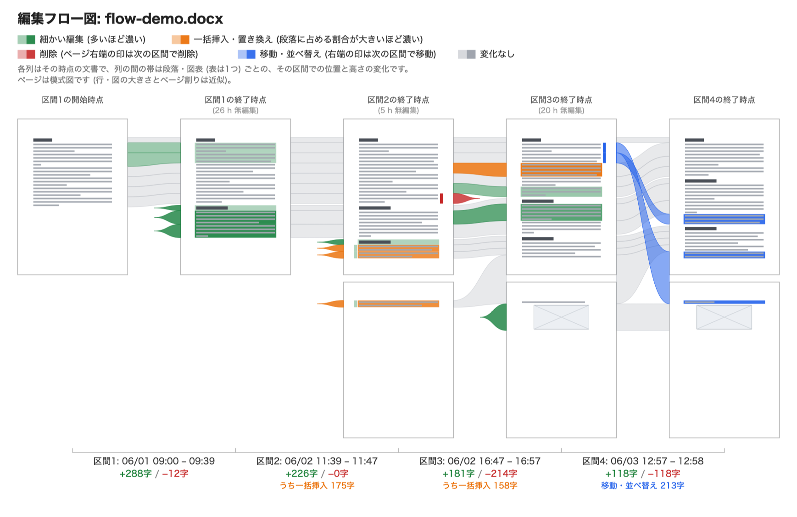
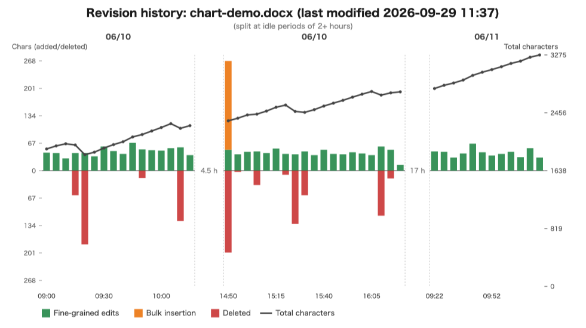
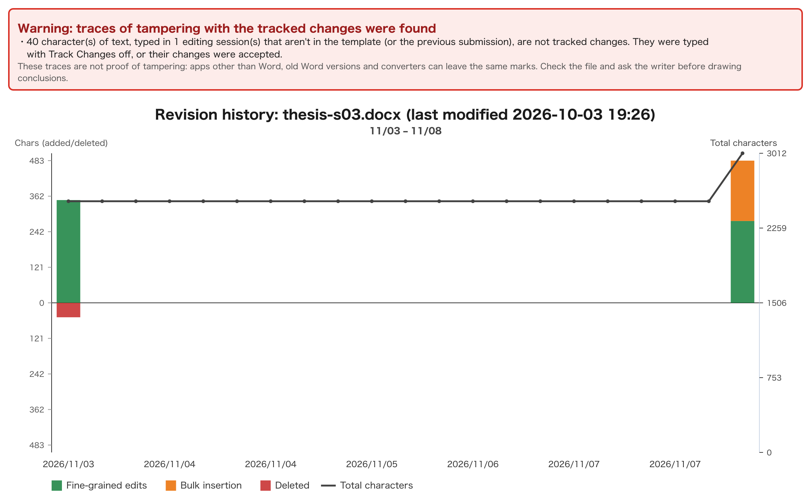
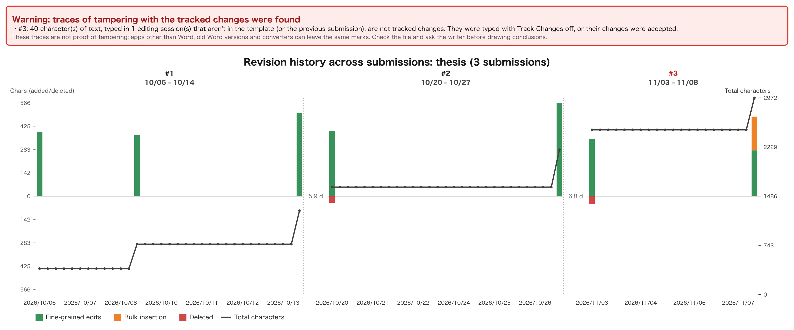

# docx-revision-analyzer

[](./LICENSE)
English | [日本語](./README.ja.md)

Tools that draw **how a document was written** from the tracked changes (Track Changes) recorded in a Word `.docx`.
They show when, where and how much was added, deleted or pasted in at once, as a chart over time and as an edit flow
that links schematic pages of the document.



| Command | What it does |
|---|---|
| `docx-revision-chart` | Charts the characters added and deleted, and the total length, over time (SVG) |
| `docx-revision-flow` | For each session of continuous editing, draws schematic pages at its start and end, with bands showing how each paragraph, figure and table changed |
| `docx-ai-suspicion-score` | Scores, from 0 to 100, unnatural jumps in length that suggest text written elsewhere was pasted in |
| `docx-revision-snapshot` | Archives each submission of a long-running document (such as a thesis) under a serial number and charts the history across all of them |
| `docx-revision-versions` | Rebuilds the document as it was at earlier points in time from its tracked changes and writes each version out (.docx or text) |

They can also check submissions for **traces of tampering** (with a warning in the figure) and put a **Track Changes
lock** on the template you hand out. They come as an npm package, single executables that need no Node.js,
drag-and-drop apps, and a desktop app (preview). Everything is analyzed on your own computer; documents are never sent
anywhere.

> **What this is for**: a tool for writers to look back on how their own document was written — not a way to police
> others. Tracked changes can be left out or rewritten, and nothing these tools output is proof of how a document was
> written (see [Limitations](#limitations)).

---

## Use cases

### 1. Looking back on your own writing

Turn Track Changes on before you start, and once you have finished you can see which day you wrote what, and where you
made big revisions.

```bash
docx-revision-flow report.docx -p 2     # draw the edit flow, splitting sessions at idle gaps over 2 hours
docx-revision-versions report.docx      # write out the document as it was at the end of each session
```

### 2. Checking assignment submissions (Microsoft Teams)

The teacher makes a template with Track Changes locked and hands each student a copy through a Teams assignment. The
submissions are analyzed a folder at a time; those with traces such as tracking turned off, the lock removed, or a
different document swapped in get a warning in the figure and a distinct file name.

```bash
docx-revision-chart --lock template.docx                      # lock Track Changes in the template
docx-revision-chart submissions/ --template template.docx      # draw the submissions, checking each against the template
```

### 3. Supervising a thesis sprint by sprint

For a document written over months, have it handed in at the end of each sprint, archive it, and hand it back with the
changes accepted. Even when old versions disappear and rewrites of your own pending text leave no record, every
revision across sprints is kept, and you can look back across all of them.

```bash
docx-revision-snapshot archive/ submissions-sprint3/          # archive sprint 3 and redraw the chart across sprints
```

The step-by-step procedures with Word, OneDrive and Teams are in the [operations guide](docs/operations-guide.md).

---

## The `.docx` files these tools expect

**These tools are meant for `.docx` files in state D below ("Sufficient"): files that hold enough tracked
changes, recorded over a long enough period, for their content to be analyzed.** The tools read the tracked
changes (`w:ins` / `w:del`, with their `w:date` and `w:author`) stored inside a `.docx`, and how much a file can
tell you depends on how much of that history it still holds. A document starts in state A and is always in one of
four states:


| State | The document | What the tools do |
|---|---|---|
| **A: No tracking** | Track Changes is off, so edits leave no record | Exit with an error saying the file was saved with Track Changes off |
| **B: Tracking on** | Track Changes is on, but nothing has been edited since | Exit with an error saying there are no tracked changes yet |
| **C: Too sparse** | Some edits are recorded, but too few or over too short a time | Run, but the chart and flow show little, and `docx-ai-suspicion-score` warns that fewer than 5 insertion events are statistically weak |
| **D: Sufficient** | Enough edits recorded over a long enough period | **What these tools are for:** produce meaningful results |

A document moves forward, A → B → C → D, as you keep writing with Track Changes on. Turn it on (Review tab →
Track Changes) **before** you start writing; what was typed while it was off is never recorded.

It can also move backward, and every red path in the figure loses tracked changes:

- **D → C:** accepting or rejecting individual changes removes them from the history, which can leave too little
  to analyze.
- **C / D → B:** "Accept All" or "Reject All" removes every tracked change. Track Changes stays on, so the
  document is back to "tracking on, no changes yet".
- **C / D → A:** "Accept All Changes and Stop Tracking" removes every tracked change and turns tracking off.

Turning Track Changes off is not one of these: in state C or D the changes already recorded stay in the file, and
only later edits go unrecorded. In state B it takes the document back to A, but there is nothing to lose there.

**Lost tracked changes can't be brought back** (for files saved on OneDrive, see the
[operations guide](docs/operations-guide.md#files-saved-on-onedrive)), so to keep the history, analyze — or keep a
copy of — the file before accepting or rejecting changes.

Also check that each change keeps its timestamp. If the document is set to remove personal information on save,
Word strips the author and date of every tracked change, so the timeline is lost even in state D; see
"[When timestamps are missing](docs/usage.md#when-timestamps-are-missing---preserve-history)".

---

## Example output

### Revision history chart (`docx-revision-chart`)



Three writing sessions over two days, laid out side by side split at idle gaps over 2 hours (`-p 2`). Upward bars are
characters added (green for fine-grained edits, orange for bulk insertions pasted in at once), red downward bars are
characters deleted, and the line is the total length. The text pasted in at the start of the second session shows up in
orange. → [How to read the chart](docs/usage.md#how-to-read-the-chart)

### Edit flow (`docx-revision-flow`)

The figure at the top. Each column is the document's pages at that point, and the bands between columns show how each
paragraph, figure and table changed (green for fine-grained edits, orange for bulk insertions and replacements, red for
deletions, blue for moves and reordering). → [How to read it](docs/usage.md#how-to-read-it)

### Warning about traces of tampering



A submission with a paragraph typed while Track Changes was off. Figures with traces get a warning at the top and a
name ending in `-tampered` (`<name>-tampered.svg`), so they stand out even among many submissions.
→ [Detecting traces of tampering](docs/usage.md#detecting-traces-of-tampering)

### History across sprint submissions (`docx-revision-snapshot`)



A thesis handed in three times. Each submission is one panel, with the idle time between them (such as 5.9 d).
Changes already present in an earlier submission are not counted again.
→ [`docx-revision-snapshot`](docs/usage.md#4-docx-revision-snapshot--archive-and-chart-submissions-over-time)

### AI-misuse suspicion score (`docx-ai-suspicion-score`)

```json
{
  "file": "suspicious-paste.docx",
  "score": 93,
  "riskLevel": "very_high",
  "topSuspiciousEvents": [
    { "date": "2026-05-11T14:02:37.911Z", "chars": 295, "dtSeconds": 1, "impliedCps": 295, "eventScore": 100 }
  ]
}
```

A document typed little by little, then with 295 characters inserted within a second.
→ [How the score is computed](docs/usage.md#how-the-score-is-computed)

---

## Benefits

- **You see the writing process, not just the finished text.** When, where and how much was written, deleted or
  pasted in at once, tied to positions in the document.
- **Runs on what Word and Teams already provide.** Writers don't install anything; they just write with Track Changes on.
- **Handles many submissions at once.** Pass a folder to get figures for every `.docx` plus an index (`summary.csv`,
  `index.html`); submissions with traces stand out by file name.
- **Works for long-running writing.** Sprint submissions are archived under serial numbers and can be viewed across
  all of them.
- **Documents stay on your computer.** All analysis is local; the desktop app blocks network access except to load
  documents from OneDrive / SharePoint.
- **English and Japanese, and usable as a library.** The analysis and drawing core also runs in browsers.

## Limitations

- **Track Changes is required.** Edits made while it is off leave no record; the tools are for documents in state D
  above.
- **Nothing they output is proof.** Tracked changes can be left out or rewritten by turning tracking off, accepting
  changes, or editing the XML. Finding no trace of tampering doesn't prove there was none, and saving with an app
  other than Word can leave traces by itself.
- **Scores and highlights are heuristics.** Fast typists, and writers who draft in another app and paste their own
  text in, can score high (false positives); AI text copied in by hand a little at a time slips through (misses).
  Always leave the judgment to a person who knows the context.
- **Some edits are never recorded.** Deleting text you inserted yourself leaves no record, and Word often records
  times only to the minute.
- **Only the body text is analyzed.** Footnotes, headers and text boxes are not, and the pages in the flow are a
  schematic approximation.
- **Some environments are not fully checked yet.** Tamper detection on files saved by Word for the web has not been
  fully verified. The Track Changes lock is weak protection that editing the file can remove.

---

## Documentation

| Document | Contents |
|---|---|
| [Installation](docs/installation.md) | Getting and setting up the npm package, single executables, drag-and-drop apps and desktop app |
| [Usage](docs/usage.md) | The four commands' options and how to read the figures, traces of tampering, missing timestamps, settings files, display language, the desktop app |
| [Operations guide](docs/operations-guide.md) | Running it with Word, OneDrive and Teams (locking the template, handing it out through assignments, instructions for students, sprint submissions, checking submissions) |
| [Advanced usage](docs/advanced.md) | The analysis JSON, annotations on figures, highlight rules, integrity notes |
| [Using it as a library](docs/library.md) | Using it from Node.js and browsers, classifiers, color categories, where each edit happened |
| [Developer guide](docs/development.md) | Building from source, making the single executables and drag-and-drop apps, publishing, fixtures, directory layout |

## Contributing and license

Issues and pull requests are welcome ([GitHub Issues](https://github.com/kubohiroya/docx-revision-analyzer/issues)).
Licensed under [MIT](./LICENSE) © 2026 Hiroya Kubo.
