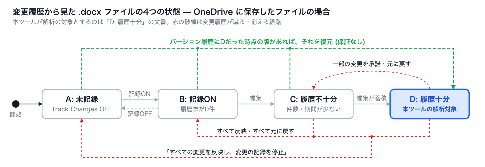

# 運用ガイド

[English](./operations-guide.md) | 日本語 · [README に戻る](../README.ja.md)

Word・OneDrive・Microsoft Teams と組み合わせて、解析できる変更履歴を確実に残し、提出物を調べるための手順です。各コマンドの詳細は[使い方](usage.ja.md)を参照してください。

**目次**

- [書き手が自分で使う場合](#書き手が自分で使う場合)
- [OneDrive に保存したファイルの場合](#onedrive-に保存したファイルの場合)
- [授業で使う場合: 変更履歴をロックしたテンプレートを Teams の課題で配る](#授業で使う場合-変更履歴をロックしたテンプレートを-teams-の課題で配る)
- [長期の執筆 (卒論など): 区切りごとに提出させる](#長期の執筆-卒論など-区切りごとに提出させる)
- [提出物を調べる](#提出物を調べる)

## 書き手が自分で使う場合

自分の文書の執筆過程を振り返るために使うなら、次の点を守れば、解析できる変更履歴が残ります
(文書の状態は README の[状態遷移図](../README.ja.md#前提とする-docx-ファイル)を参照)。

- 書き始める**前に**、変更履歴の記録をオンにする (校閲タブ → 変更履歴の記録)。オフの間の編集は記録されません。
- 書き終えるまで、変更を承諾したり元に戻したりしない。承諾・元に戻すと、その変更は履歴から消えます。
- 文書が「保存時に個人情報を削除する」設定になっていないかを確かめる。この設定だと、保存のたびに作成者と日時が消えます。
  ツールが見つけて案内します (「[日時が記録されない場合](usage.ja.md#日時が記録されない場合---preserve-history)」)。
- 承諾して清書する前に解析するか、ファイルのコピーを取っておく。
- できれば OneDrive に保存する (次の節)。

## OneDrive に保存したファイルの場合

OneDrive はファイルの以前の版を「バージョン履歴」に残すため、手元のコンピュータに保存したファイルにはない戻り道があります。
下図は、README の[状態遷移図](../README.ja.md#前提とする-docx-ファイル)にその経路を加えたものです。



状態Dだった時点に保存された版がバージョン履歴に残っていれば、それを復元すると、現在どの状態にあっても文書はDに戻ります。
これはファイル全体を以前の版に戻す操作なので、その後の編集は含まれません。また保証はありません。OneDrive が残す版の数には
上限があり、一度も状態Dになったことのないファイルには、復元できるそのような版がありません。

## 授業で使う場合: 変更履歴をロックしたテンプレートを Teams の課題で配る

レポート課題でこのツールを使うなら、教員が変更履歴の記録をオンにしたテンプレートを用意し、Microsoft Teams の課題で
履修者ごとにそのコピーを配る方法が確実です。テンプレートには、Word 標準の「変更履歴のロック」をかけておくこともできます。

### 1. テンプレートを作る

タイトル、学籍番号、氏名の欄は空けておき、学生が記入します。必要に応じて、レポートの章立てや本文のダミーを入れておくと、
学生はそれを上書きして書き進めます。最後に、変更履歴の記録をオン (校閲タブ → 変更履歴の記録) にして保存します。
これでテンプレートは状態Bになります。

### 2. 変更履歴をロックする (任意)

**設定手順 (教員側)**

- **Windows 版:** 校閲タブ →［変更履歴の記録］の▼ →［変更履歴のロック］を選び、パスワードを入力して［OK］
- **Windows 版 (別の手順):** 校閲タブ →［編集の制限］→「2. 編集の制限」で「ユーザーに許可する編集の種類を指定する」に
  チェックを入れ、一覧から「変更履歴」を選ぶ →「3. 保護の開始」の［はい、保護を開始します］→ パスワードを入力
- **Mac 版:** 校閲タブ →［文書の保護］(バージョンによっては［保護］→［文書の保護］) で「変更履歴」を選び、パスワードを入力

パスワードは省略できますが、省略すると誰でも同じメニューからロックを外せるため、設定してください。テンプレートを
後で直すときは、同じメニューからパスワードを入力してロックを外し、直したら再びロックします。

**本ツールでロックをかける**

Word を操作する代わりに、本ツールでもロックをかけられます。どちらも「変更履歴の記録」をオンにし、保存時に作成者・日時を
削除する設定があれば外します。

- **CLI:** `--lock` を付けて、テンプレートを渡します。パスワードを2回尋ね、元のファイルにロックをかけて上書きします
  (元のファイルは `<名前>.backup-<日時>.docx` として残します)。図は作りません。

  ```bash
  docx-revision-chart --lock template.docx
  ```

  ターミナルが無い環境 (ドラッグ&ドロップ起動など) では、パスワードを環境変数 `DOCX_LOCK_PASSWORD` で渡します。
  渡さなければパスワード無しでロックします。ただし、すでにパスワード付きでロックされたファイルは、パスワード無しで
  置き換えずにエラーにします。
- **デスクトップアプリ:** テンプレートを開き (ドロップし)、［テンプレートにロックを施す］を押します。パスワードを入力すると、
  ロックをかけたものを保存するダイアログが開きます (既定の名前は `<名前>-locked.docx`)。開いたファイル自体は変更しません。

パスワードのハッシュ値は、仕様 (ECMA-376) と Apache POI の実装に合わせて、Word 2013 以降と同じ形式 (SHA-512、10 万回) で
作ります。Word の［変更履歴のロック］のメニューから同じパスワードで外せるはずですが、配る前に一度、Word で開いて外せることを
確かめてください。

**この設定で起きること**

- 変更履歴の記録は常にオンになり、パスワードを知らない学生はオフにできません。
- ［承諾］と［元に戻す］はグレーアウトし、押せなくなります。そのため、学生の操作で変更履歴が消える経路
  (状態D → C、C / D → B、C / D → A) がふさがれます。
- 本文の入力や削除はふだんどおりでき、すべて変更履歴として記録されます。
- ファイルの中では、`word/settings.xml` に `<w:documentProtection w:edit="trackedChanges" w:enforcement="1" .../>` と
  `<w:trackRevisions/>` が書き込まれます。ロックはこのファイルの設定なので、テンプレートのコピーにも引き継がれます。

**限界**

ロックは強い保護ではありません。パスワードはハッシュ値として `settings.xml` に保存されているだけで、`.docx` を zip として
展開してこの要素を消せば外れます。本文を全選択して新しい文書に貼り付ければ、ロックも変更履歴もない文書になりますし、
Word 以外のアプリでロックが守られる保証もありません。また、記録中に自分が挿入した文字を削除すると、ロックしていても
削除の記録は残らず、文字ごと消えます (Word の仕様)。ロックは「うっかり」を防ぐものと考え、提出されたファイルが
テンプレートから作られたものかを確かめる手段と組み合わせてください。本ツールは、提出されたファイルにロックを外した跡や
記録をオフにして入力した跡が残っていれば、図に警告を表示します ([改ざんの痕跡の検出](usage.ja.md#改ざんの痕跡の検出))。
配ったテンプレートを `--template` で渡すと、テンプレートとも照合します。

ロックしたファイルを学生が実際に使うアプリ (Word デスクトップ版、Word for the web など) で編集できるかは、配る前に
テスト用のアカウントで確かめてください。保護された文書は、アプリによっては編集できないことがあります。

### 3. Teams の課題で配る

1. Teams で「課題」を選び、新しい課題を作る
2. 課題のタイトルと説明を入力する
3. 「添付」から、1. (と 2.) で作ったテンプレートのファイルを選ぶ
4. 添付したファイルの下の「受講者は編集できません」をクリックし、**「受講者は自分のコピーを編集」**に変える

学生が課題を開くと、テンプレートをもとに学生ごとの専用のコピーが自動で作られます。学生はそのコピーを OneDrive 上で、
自動保存が有効な状態で編集し、そのまま提出します。

### 4. 学生に伝えておく

- 執筆中は［承諾］も［元に戻す］も使わない (ロックしていれば、そもそも押せない)。
- 変更の表示が気になる場合は、表示を「変更履歴/コメントなし」にすれば清書された状態で書ける。表示を切り替えても、
  記録は続く。
- 画面左上の「自動保存」をオンのままにしておく。オフにすると保存の回数が減り、バージョン履歴に残る版も少なくなる。

### この方法が確実な理由

- 学生が自分で記録をオンにする必要がありません。各自のコピーは状態Bから始まるため、オンにし忘れて状態Aのまま
  書き進めてしまうことがありません。ロックしていれば、途中でオフにすることもできません。
- 各自のコピーは OneDrive 上にあり、自動保存されるため、[前述](#onedrive-に保存したファイルの場合)のバージョン履歴が
  細かく残ります。
- 学生はそのコピーを開いて書き、そのまま提出します。ダウンロードして手元で作り直したファイルに差し替えられる機会が減ります。

## 長期の執筆 (卒論など): 区切りごとに提出させる

何か月もかけて書く文書では、2つの理由で変更履歴が失われていきます。

- OneDrive のバージョン履歴は、数や期間の上限、組織の保持ポリシーによって古いものから消えます。
- 記録中に自分が挿入した文字は、承諾されるまで「自分の未確定の挿入」です。これを削除しても削除の記録は残らず、
  文字ごと消えます。同じ箇所を何度も書き直すと、途中の版は残りません。

そこで、区切り (スプリント。1〜2週間や、章ごとの節目) ごとに提出させ、教員が保管してから、変更をすべて承諾して返します。
承諾した後の文章を書き直すと削除として記録されるため、区切りをまたぐ推敲はすべて残ります。失われるのは、1つの区切りの中での
書き直しだけです。

1. 学生が区切りで提出する。
2. 教員が提出物を [`docx-revision-snapshot`](usage.ja.md#4-docx-revision-snapshot--区切りごとの提出の保管と通し解析) で保管する。
   通し番号を付けて保管し、前回の提出と照合して、各回の図とすべての回を通したチャートを作る。
3. 教員が同じファイルを Word で開き、ロックを外して［すべての変更を反映］し、再びロックして保存する。
4. 返却し、学生は同じファイルで続きを書く。

提出されたファイルは学生の OneDrive にあり、学生が消すこともできるため、保管は教員の手元で行います。


これらを課題の要件にする場合は、シラバスの「履修上の注意」などにあらかじめ書いておくとよいでしょう。記載例:

> この授業では学修プロセスの正当性を確保するため、「テンプレートをもとにしたファイル提出」を求める課題において、
> OneDrive 上での作業、変更履歴の記録の常時オン、バージョン履歴の保持を必須とします。
> これに従えないという正当な理由がある学生は、事前に教員へ申し出てください。学生側での対応に不備がある場合には、
> 成績評価の対象外となります。

## 提出物を調べる

集めた提出物は、フォルダごとまとめて解析できます。配ったテンプレートを `--template` で渡すと、テンプレートとも照合して
[改ざんの痕跡](usage.ja.md#改ざんの痕跡の検出)を調べます。

```bash
docx-revision-chart 提出物/ --template template.docx
docx-revision-flow 提出物/ --template template.docx
```

- 各提出物の隣に、チャート (`<名前>.svg`) とフロー (`<名前>-flow.svg`) ができます。痕跡が見つかった提出物の図には
  赤い枠の警告が付き、ファイル名の末尾が `-tampered` になります (`<名前>-tampered.svg`)。
- コマンドラインを使わない場合は、[デスクトップアプリ](usage.ja.md#デスクトップアプリ-プレビュー)にフォルダをドロップするか、
  Teams の課題の提出物が集まる SharePoint のフォルダのリンクを開きます。一覧 (`summary.csv`・`index.html`) も作ります。
- 区切りごとに提出させている場合は、[`docx-revision-snapshot`](usage.ja.md#4-docx-revision-snapshot--区切りごとの提出の保管と通し解析)
  で保管します。

**痕跡や一括挿入のハイライトは、不正の証拠ではありません。** Word 以外のアプリで保存しただけでも痕跡は残り、別のアプリで
下書きしてから貼り付けた本人の文章も一括挿入に見えます。図は、書いた本人と執筆の過程を振り返る話をするための材料として
使ってください。
