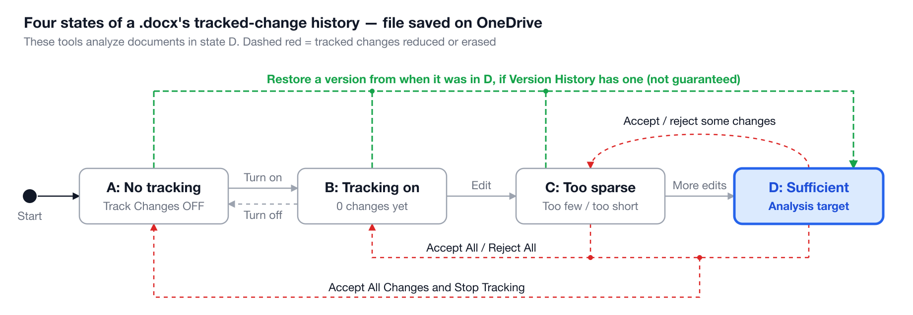

# Operations guide

English | [日本語](./operations-guide.ja.md) · [Back to the README](../README.md)

How to combine the tools with Word, OneDrive and Microsoft Teams so that analyzable tracked changes are reliably kept, and how to check submissions. For each command's details, see [Usage](usage.md).

**Contents**

- [Writers using it on their own documents](#writers-using-it-on-their-own-documents)
- [Files saved on OneDrive](#files-saved-on-onedrive)
- [In a class: hand out a template with locked tracking through a Teams assignment](#in-a-class-hand-out-a-template-with-locked-tracking-through-a-teams-assignment)
- [Long-running writing (such as a thesis): submissions at each sprint](#long-running-writing-such-as-a-thesis-submissions-at-each-sprint)
- [Checking submissions](#checking-submissions)

## Writers using it on their own documents

To look back on how you wrote your own document, keep to the following and the tracked changes stay analyzable
(for the document states, see the [state diagram](../README.md#the-docx-files-these-tools-expect) in the README).

- Turn Track Changes on **before** you start writing (Review tab → Track Changes). Edits made while it is off are
  not recorded.
- Don't accept or reject changes until you have finished. Accepted or rejected changes disappear from the history.
- Check that the document doesn't remove personal information on save; if it does, every save strips the authors
  and dates. The tools detect this and offer to fix it (see
  [When timestamps are missing](usage.md#when-timestamps-are-missing---preserve-history)).
- Analyze the document, or keep a copy, before accepting changes to make a clean copy.
- If you can, save it on OneDrive (next section).

## Files saved on OneDrive

OneDrive keeps earlier versions of a file in Version History, which adds a way back that a file on your computer
doesn't have. The diagram below adds that path to the [state diagram](../README.md#the-docx-files-these-tools-expect) in
the README:



If a version saved while the document was in state D is still in Version History, restoring it brings the document
back to D, whichever state it is in now. This restores an earlier copy of the whole file, so later edits are not in
it, and it isn't guaranteed: OneDrive keeps only a limited number of versions, and a file that was never in state D
has no such version to restore.

## In a class: hand out a template with locked tracking through a Teams assignment

To use these tools on student reports, the reliable way is for the teacher to prepare a template with Track
Changes on and hand each student a copy of it through a Microsoft Teams assignment. The template can also be
protected with Word's built-in Lock Tracking.

### 1. Make the template

Leave the title, student ID and name blank for students to fill in. If useful, add the report's section headings
or dummy body text for students to write over. Finally, turn Track Changes on (Review tab → Track Changes) and
save. The template is now in state B.

### 2. Lock tracking (optional)

**How to set it (teacher)**

- **Word for Windows:** Review tab → the Track Changes ▼ → Lock Tracking, enter a password, then OK
- **Word for Windows (another way):** Review tab → Restrict Editing → under "2. Editing restrictions", check "Allow
  only this type of editing in the document" and choose "Tracked changes" → under "3. Start enforcement", click
  "Yes, Start Enforcing Protection" → enter a password
- **Word for Mac:** Review tab → Protect Document (in some versions, Protect → Protect Document), choose "Tracked
  changes" and enter a password

The password is optional, but without one anyone can unlock tracking from the same menu, so set one. To edit the
template later, unlock it from the same menu with the password, make your changes, and lock it again.

**Locking with these tools**

Instead of using Word, you can lock the template with these tools. Both also turn Track Changes on, and turn off
the setting that removes authors and dates on save if it is set.

- **CLI:** pass the template with `--lock`. It asks for the password twice and locks the file in place (the
  original is kept as `<name>.backup-<date>.docx`). No figure is drawn.

  ```bash
  docx-revision-chart --lock template.docx
  ```

  Where there is no terminal (such as when launched by drag and drop), pass the password in the
  `DOCX_LOCK_PASSWORD` environment variable. Without it the file is locked with no password, except that a file
  already locked with a password is left unchanged with an error rather than re-locked without one.
- **Desktop app:** open (drop) the template and click "Lock template". After you enter the password, a dialog asks
  where to save the locked copy (named `<name>-locked.docx` by default). The opened file itself is not changed.

The password hash follows the specification (ECMA-376) and Apache POI's implementation, in the format Word 2013
and later use (SHA-512, 100,000 rounds), so Word's Lock Tracking menu should accept the same password. Before
handing the template out, open it in Word once and check that the password unlocks it.

**What this does**

- Track Changes stays on, and students who don't know the password can't turn it off.
- Accept and Reject are grayed out and can't be used. This closes the ways a student could lose tracked changes
  (state D → C, C / D → B, C / D → A).
- Typing and deleting work as usual, and every edit is recorded as a tracked change.
- Inside the file, `word/settings.xml` gets `<w:documentProtection w:edit="trackedChanges" w:enforcement="1" .../>`
  and `<w:trackRevisions/>`. The lock is a setting of the file, so copies of the template keep it.

**Limits**

The lock is not strong protection. The password is stored only as a hash in `settings.xml`, and unzipping the
`.docx` and deleting that element removes the lock. Selecting all the text and pasting it into a new document
gives a document with neither the lock nor any tracked changes, and apps other than Word may not honor the lock.
Also, deleting text you inserted while tracking removes it outright, leaving no record of the deletion, even with
the lock on (this is how Word works). Treat the lock as a guard against mistakes, and pair it with a way to check
that a submitted file was made from the template. These tools show a warning in the figure when a submitted file
has traces of the lock being removed or of text typed with tracking off (see
[Detecting traces of tampering](usage.md#detecting-traces-of-tampering)); pass the template you handed out with
`--template` to also check each file against it.

Before handing it out, check with a test account that the locked file can be edited in the app students will
actually use (Word desktop, Word for the web and so on). Some apps may not let you edit a protected document.

### 3. Hand it out with a Teams assignment

1. In Teams, open Assignments and create a new assignment
2. Enter the assignment's title and instructions
3. Under Attach, choose the template file from step 1 (and 2)
4. Click "Students can't edit" below the attached file and change it to **"Students edit their own copy"**

When a student opens the assignment, a copy of the template just for them is created automatically. They edit
that copy on OneDrive with AutoSave on, and turn it in as is.

### 4. Tell students what to do

- Don't use Accept or Reject while writing (with the lock on, they can't).
- If the markup gets in the way, set the display to "No Markup" to write on a clean view; changing the display
  doesn't stop the recording.
- Keep AutoSave (top left of the window) on. Turning it off means fewer saves, so fewer versions are kept in
  Version History.

### Why this is reliable

- Students don't have to turn Track Changes on themselves. Each copy starts in state B, so nobody ends up writing
  in state A because they forgot. With the lock on, nobody can turn it off midway either.
- Each copy lives on OneDrive and is saved automatically, so the Version History described
  [above](#files-saved-on-onedrive) keeps a fine-grained record.
- Students open their copy, write in it and turn it in as is, which leaves less room to swap in a file rebuilt on
  their own computer.

## Long-running writing (such as a thesis): submissions at each sprint

In a document written over months, tracked changes get lost in two ways:

- OneDrive's Version History drops old versions, because of limits on their number and age and the
  organization's retention policies.
- Text you typed while tracking is your own pending insertion until it is accepted. Deleting it leaves no record
  of the deletion; it simply disappears. Rewrite the same passage several times and the drafts in between are gone.

So have the writer hand the document in at the end of each sprint (one or two weeks, or each chapter), archive
it, then accept all the changes and hand it back. Rewriting accepted text is recorded as a deletion, so every
revision across sprints is kept; only rewrites within a single sprint are lost.

1. The student hands the document in at the end of the sprint.
2. The teacher archives it with [`docx-revision-snapshot`](usage.md#4-docx-revision-snapshot--archive-and-chart-submissions-over-time),
   which numbers it, checks it against the previous submission, and draws each submission's figures and a chart
   across all of them.
3. The teacher opens the same file in Word, unlocks it, clicks "Accept All Changes", locks it again and saves.
4. The teacher hands it back, and the student continues in the same file.

The submitted file sits in the student's OneDrive, where the student can delete it, so keep the archive on the
teacher's side.


If you make these requirements of the assignment, state them in advance, for example in the syllabus's notes for
students. A sample:

> To ensure the integrity of the learning process, assignments in this course that require submitting a file based
> on a template must be worked on in OneDrive, with Track Changes kept on at all times and the Version History
> preserved. Students with a legitimate reason they cannot follow this must tell the instructor in advance.
> Submissions that do not meet these requirements will not be graded.

## Checking submissions

You can analyze a whole folder of submissions at once. Pass the template you handed out with `--template` to also
check each file against it for [traces of tampering](usage.md#detecting-traces-of-tampering).

```bash
docx-revision-chart submissions/ --template template.docx
docx-revision-flow submissions/ --template template.docx
```

- A chart (`<name>.svg`) and a flow (`<name>-flow.svg`) are written next to each submission. Figures of submissions
  with traces get a red-bordered warning and a name ending in `-tampered` (`<name>-tampered.svg`).
- Without the command line, drop the folder onto the [desktop app](usage.md#desktop-app-preview), or open the link
  to the SharePoint folder where a Teams assignment's submissions are collected. It also writes an index
  (`summary.csv`, `index.html`).
- If writers hand in at each sprint, archive the submissions with
  [`docx-revision-snapshot`](usage.md#4-docx-revision-snapshot--archive-and-chart-submissions-over-time).

**Traces and bulk-insertion highlights are not proof of misconduct.** Saving with an app other than Word is enough to
leave traces, and a writer's own text drafted in another app and pasted in looks like a bulk insertion. Use the
figures as material for talking with the writer about how the document was written.
